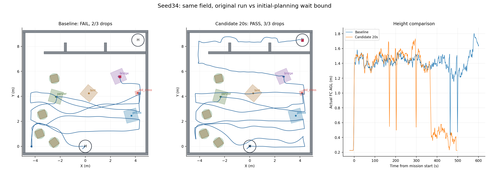

# seed34候选修复重跑：完整37/37 PASS

2026-09-11，按用户新增授权只重跑seed34一次。保留原全随机靶子、树箱、LL门布局及机架/任务参数，显式开启`search_initial_plan_timeout:=20`。**三投、三次恢复、9点投后路线、两门及终点自主降落全部完成，原工程Gate为37/37 PASS，零碰撞。**

## 实际改善

| 指标 | 上次seed34 | 本次20秒候选 |
|---|---:|---:|
| 原始Gate | FAIL，17/37 | **PASS，37/37** |
| 搜索失败等待合计 | 360.056s，4次 | **39.996s，2次** |
| 首投距任务起点 | 462.960s | **170.129s** |
| 投递mock确认/恢复 | 2/3、2/3 | **3/3、3/3** |
| 投后航点/门 | 0/9、0/2 | **9/9、2/2** |
| 任务起点至自主落地观测 | 未完成 | **493.066s** |
| 工程Gate任务完成时间 | 600s截止仍未完成 | **495.735s** |
| 碰撞 | 0 | 0 |
| 最终H中心误差 | 未在终点落地 | **1.62cm** |

落地按自主LAND之后的ON_GROUND观测并结合真实终点包络核对，与disarm工程状态分开。最后55×55×40cm保守包络八角投影最大半径0.405m，位于名义半径0.5m黑圈内。mock释放不是包裹实物落点验收。

## 修复机制是否真实生效

本轮22.416s首次请求西侧(-4.3,0,1.18)；一直没有轨迹，于42.411s产生新的`search_initial_plan_timeout`，随后按现有策略重试；62.418s第二次约20s超时后推进覆盖。之后取得轨迹的搜索动作没有被新上限截断；三投/返航/降落均仍使用原处理。

上次卡住的是东侧(4.3,0)/(4.3,0.7)，本轮卡住的是起始西侧目标。世界与实际靶标坐标/朝向完全一致，但传感器、建图和规划调度并非确定性。因此不能把此次结果解释为“相同四个失败动作统一从90变20”，也不能保证以后每轮固定省320秒。可确认的是：**新上限实际两次触发、取消/重试/推进链完整，且此seed本轮完成了全任务**。

[逐请求时刻与同场景检查](comparison.json) · [本轮场地/航线/高度/阶段图](seed_34.png) · [降落末段图](seed_34/terminal_diagnostics.png) · [原始Gate](seed_34/gate_status.json)。

## 版本与边界

- 原始五seed版本7eb9446；本次候选飞行源d7346c2274b8d60060c4d4a3d9ea10b7b9ea0d1d。
- 冻结world、field_config、runtime、gate_geometry、scene、机架/动力学/雷达文件逐字一致，实际五靶布局也一致。仅将本次候选参数显式设20；其余飞行算法未修改。
- 开跑前254项回归通过，含7项新增边界测试；两工作区实际构建与默认0/显式20静态展开通过。
- 只运行本次一轮；0视频、0全場bag，统一包装器收尾与进程复查通过。原始run在`logs/r2026_seed34_initial_wait20_20260911_141613`。
- 原五组2/5统计不追改、不混合成新版本3/5；本轮只是一个配对seed观察。
- seed31近地IMU、seed33门后地图占据及ABORT回收策略未修，也未追加重跑。

## 保留方式

保留这项小范围修复候选，默认参数仍为0关闭。启用该候选需显式传`search_initial_plan_timeout:=20`；没有将20秒替换成全场运动超时，也没有自动跳过投递或过门。

当前d1ab9208机载/仿真两包与main验收基线保持不变，本次不再次打包。单轮改善值得保留候选，但不足以直接宣称多seed或实机鲁棒性达标。
