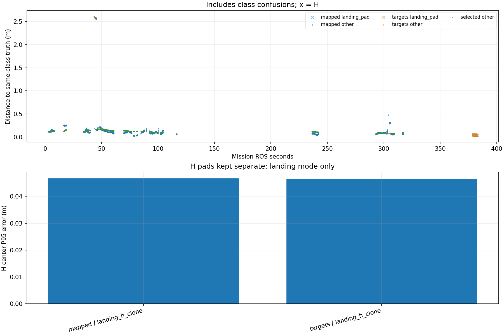

# Recorded target-center comparison

Phase-specific interpretation: [frozen SURVEY, interrupt and low reacquisition comparison](stages/PHASE_REPORT.md). The full-mission statistics below are not initial-high or low-only values.

Scope: 38_resume_off
Gate: FAIL. Same-source route/speed matrix; see main report for paired comparisons and failures.

Run: /home/xhj/liftrace-worktrees/r2026-high-view-search/logs/seed38_resume_resume_off_seed38_20261005_161407
World: /home/xhj/liftrace-worktrees/r2026-high-view-search/docs/verification/seed38_resume_20261005/generated/resume_off_38/resume_off_seed38/field.world
Coordinate transform: FLU world XY equals mission XY; local Z ground=-0.22, only XY distances compared

Distances below are to same-class truth; inspect the class/instance table before interpreting localization.

| Scope | Stream | Class | Truth instance | N | Median/m | P95/m | RMSE/m | Max/m |
|---|---|---|---|---:|---:|---:|---:|---:|
| unique_valid_mission | hint_bbox | bridge | random_bridge | 9 | 0.1206 | 0.1664 | 0.1327 | 0.1728 |
| unique_valid_mission | hint_bbox | panzer | random_panzer | 15 | 2.5828 | 2.6779 | 2.5955 | 2.6817 |
| unique_valid_mission | hint_bbox | pillbox | random_pillbox | 6 | 0.2458 | 0.3202 | 0.2487 | 0.3282 |
| unique_valid_mission | hint_bbox | red_cross | random_red_cross | 4 | 0.1336 | 0.1346 | 0.1325 | 0.1347 |
| unique_valid_mission | hint_bbox | tent | random_tent | 3 | 2.8243 | 2.8374 | 2.8251 | 2.8389 |
| unique_valid_mission | hint_vision | bridge | random_bridge | 20 | 0.1113 | 0.1201 | 0.1116 | 0.1216 |
| unique_valid_mission | hint_vision | panzer | random_panzer | 2 | 2.5849 | 2.5860 | 2.5849 | 2.5861 |
| unique_valid_mission | hint_vision | pillbox | random_pillbox | 4 | 0.1545 | 0.1548 | 0.1545 | 0.1548 |
| unique_valid_mission | hint_vision | red_cross | random_red_cross | 54 | 0.1328 | 0.1535 | 0.1343 | 0.1546 |
| unique_valid_mission | mapped | bridge | random_bridge | 254 | 0.0874 | 0.1527 | 0.1010 | 0.1893 |
| unique_valid_mission | mapped | landing_pad | landing_h_clone | 64 | 0.0419 | 0.0467 | 0.0408 | 0.0471 |
| unique_valid_mission | mapped | panzer | random_panzer | 279 | 0.0866 | 2.5672 | 0.7622 | 2.6080 |
| unique_valid_mission | mapped | pillbox | random_pillbox | 248 | 0.1235 | 0.1955 | 0.1336 | 0.2221 |
| unique_valid_mission | mapped | red_cross | random_red_cross | 485 | 0.1015 | 0.2481 | 0.1180 | 0.2586 |
| unique_valid_mission | mapped | tent | random_tent | 6 | 0.0633 | 0.0679 | 0.0620 | 0.0686 |
| unique_valid_mission | selected | bridge | random_bridge | 235 | 0.0990 | 0.1237 | 0.1047 | 0.1297 |
| unique_valid_mission | selected | panzer | random_panzer | 243 | 0.0825 | 0.0850 | 0.4131 | 2.5909 |
| unique_valid_mission | selected | pillbox | random_pillbox | 239 | 0.1535 | 0.1761 | 0.1543 | 0.1779 |
| unique_valid_mission | selected | red_cross | random_red_cross | 421 | 0.1231 | 0.1502 | 0.1248 | 0.1562 |
| unique_valid_mission | selected | tent | random_tent | 4 | 0.0603 | 0.0618 | 0.0603 | 0.0619 |
| unique_valid_mission | targets | bridge | random_bridge | 250 | 0.0990 | 0.1242 | 0.1046 | 0.1297 |
| unique_valid_mission | targets | landing_pad | landing_h_clone | 64 | 0.0447 | 0.0466 | 0.0443 | 0.0468 |
| unique_valid_mission | targets | panzer | random_panzer | 264 | 0.0822 | 0.0850 | 0.5336 | 2.6080 |
| unique_valid_mission | targets | pillbox | random_pillbox | 242 | 0.1538 | 0.1760 | 0.1545 | 0.1779 |
| unique_valid_mission | targets | red_cross | random_red_cross | 441 | 0.1231 | 0.1506 | 0.1249 | 0.1562 |
| unique_valid_mission | targets | tent | random_tent | 6 | 0.0591 | 0.0617 | 0.0582 | 0.0619 |
| fresh_unique_mission | hint_bbox | bridge | random_bridge | 9 | 0.1206 | 0.1664 | 0.1327 | 0.1728 |
| fresh_unique_mission | hint_bbox | panzer | random_panzer | 15 | 2.5828 | 2.6779 | 2.5955 | 2.6817 |
| fresh_unique_mission | hint_bbox | pillbox | random_pillbox | 6 | 0.2458 | 0.3202 | 0.2487 | 0.3282 |
| fresh_unique_mission | hint_bbox | red_cross | random_red_cross | 4 | 0.1336 | 0.1346 | 0.1325 | 0.1347 |
| fresh_unique_mission | hint_bbox | tent | random_tent | 3 | 2.8243 | 2.8374 | 2.8251 | 2.8389 |
| fresh_unique_mission | hint_vision | bridge | random_bridge | 20 | 0.1113 | 0.1201 | 0.1116 | 0.1216 |
| fresh_unique_mission | hint_vision | panzer | random_panzer | 2 | 2.5849 | 2.5860 | 2.5849 | 2.5861 |
| fresh_unique_mission | hint_vision | pillbox | random_pillbox | 4 | 0.1545 | 0.1548 | 0.1545 | 0.1548 |
| fresh_unique_mission | hint_vision | red_cross | random_red_cross | 54 | 0.1328 | 0.1535 | 0.1343 | 0.1546 |
| fresh_unique_mission | mapped | bridge | random_bridge | 254 | 0.0874 | 0.1527 | 0.1010 | 0.1893 |
| fresh_unique_mission | mapped | landing_pad | landing_h_clone | 64 | 0.0419 | 0.0467 | 0.0408 | 0.0471 |
| fresh_unique_mission | mapped | panzer | random_panzer | 279 | 0.0866 | 2.5672 | 0.7622 | 2.6080 |
| fresh_unique_mission | mapped | pillbox | random_pillbox | 248 | 0.1235 | 0.1955 | 0.1336 | 0.2221 |
| fresh_unique_mission | mapped | red_cross | random_red_cross | 485 | 0.1015 | 0.2481 | 0.1180 | 0.2586 |
| fresh_unique_mission | mapped | tent | random_tent | 6 | 0.0633 | 0.0679 | 0.0620 | 0.0686 |
| fresh_unique_mission | selected | bridge | random_bridge | 235 | 0.0990 | 0.1237 | 0.1047 | 0.1297 |
| fresh_unique_mission | selected | panzer | random_panzer | 243 | 0.0825 | 0.0850 | 0.4131 | 2.5909 |
| fresh_unique_mission | selected | pillbox | random_pillbox | 239 | 0.1535 | 0.1761 | 0.1543 | 0.1779 |
| fresh_unique_mission | selected | red_cross | random_red_cross | 421 | 0.1231 | 0.1502 | 0.1248 | 0.1562 |
| fresh_unique_mission | selected | tent | random_tent | 4 | 0.0603 | 0.0618 | 0.0603 | 0.0619 |
| fresh_unique_mission | targets | bridge | random_bridge | 250 | 0.0990 | 0.1242 | 0.1046 | 0.1297 |
| fresh_unique_mission | targets | landing_pad | landing_h_clone | 64 | 0.0447 | 0.0466 | 0.0443 | 0.0468 |
| fresh_unique_mission | targets | panzer | random_panzer | 264 | 0.0822 | 0.0850 | 0.5336 | 2.6080 |
| fresh_unique_mission | targets | pillbox | random_pillbox | 242 | 0.1538 | 0.1760 | 0.1545 | 0.1779 |
| fresh_unique_mission | targets | red_cross | random_red_cross | 441 | 0.1231 | 0.1506 | 0.1249 | 0.1562 |
| fresh_unique_mission | targets | tent | random_tent | 6 | 0.0591 | 0.0617 | 0.0582 | 0.0619 |
| fresh_nearest_class_agrees | hint_bbox | bridge | random_bridge | 9 | 0.1206 | 0.1664 | 0.1327 | 0.1728 |
| fresh_nearest_class_agrees | hint_bbox | pillbox | random_pillbox | 6 | 0.2458 | 0.3202 | 0.2487 | 0.3282 |
| fresh_nearest_class_agrees | hint_bbox | red_cross | random_red_cross | 4 | 0.1336 | 0.1346 | 0.1325 | 0.1347 |
| fresh_nearest_class_agrees | hint_vision | bridge | random_bridge | 20 | 0.1113 | 0.1201 | 0.1116 | 0.1216 |
| fresh_nearest_class_agrees | hint_vision | pillbox | random_pillbox | 4 | 0.1545 | 0.1548 | 0.1545 | 0.1548 |
| fresh_nearest_class_agrees | hint_vision | red_cross | random_red_cross | 54 | 0.1328 | 0.1535 | 0.1343 | 0.1546 |
| fresh_nearest_class_agrees | mapped | bridge | random_bridge | 254 | 0.0874 | 0.1527 | 0.1010 | 0.1893 |
| fresh_nearest_class_agrees | mapped | landing_pad | landing_h_clone | 64 | 0.0419 | 0.0467 | 0.0408 | 0.0471 |
| fresh_nearest_class_agrees | mapped | panzer | random_panzer | 255 | 0.0859 | 0.1294 | 0.1049 | 0.4762 |
| fresh_nearest_class_agrees | mapped | pillbox | random_pillbox | 248 | 0.1235 | 0.1955 | 0.1336 | 0.2221 |
| fresh_nearest_class_agrees | mapped | red_cross | random_red_cross | 485 | 0.1015 | 0.2481 | 0.1180 | 0.2586 |
| fresh_nearest_class_agrees | mapped | tent | random_tent | 6 | 0.0633 | 0.0679 | 0.0620 | 0.0686 |
| fresh_nearest_class_agrees | selected | bridge | random_bridge | 235 | 0.0990 | 0.1237 | 0.1047 | 0.1297 |
| fresh_nearest_class_agrees | selected | panzer | random_panzer | 237 | 0.0822 | 0.0849 | 0.0790 | 0.0850 |
| fresh_nearest_class_agrees | selected | pillbox | random_pillbox | 239 | 0.1535 | 0.1761 | 0.1543 | 0.1779 |
| fresh_nearest_class_agrees | selected | red_cross | random_red_cross | 421 | 0.1231 | 0.1502 | 0.1248 | 0.1562 |
| fresh_nearest_class_agrees | selected | tent | random_tent | 4 | 0.0603 | 0.0618 | 0.0603 | 0.0619 |
| fresh_nearest_class_agrees | targets | bridge | random_bridge | 250 | 0.0990 | 0.1242 | 0.1046 | 0.1297 |
| fresh_nearest_class_agrees | targets | landing_pad | landing_h_clone | 64 | 0.0447 | 0.0466 | 0.0443 | 0.0468 |
| fresh_nearest_class_agrees | targets | panzer | random_panzer | 253 | 0.0816 | 0.0849 | 0.0789 | 0.0850 |
| fresh_nearest_class_agrees | targets | pillbox | random_pillbox | 242 | 0.1538 | 0.1760 | 0.1545 | 0.1779 |
| fresh_nearest_class_agrees | targets | red_cross | random_red_cross | 441 | 0.1231 | 0.1506 | 0.1249 | 0.1562 |
| fresh_nearest_class_agrees | targets | tent | random_tent | 6 | 0.0591 | 0.0617 | 0.0582 | 0.0619 |
| fresh_H_landing_mode | mapped | landing_pad | landing_h_clone | 64 | 0.0419 | 0.0467 | 0.0408 | 0.0471 |
| fresh_H_landing_mode | targets | landing_pad | landing_h_clone | 64 | 0.0447 | 0.0466 | 0.0443 | 0.0468 |

## Nearest any-class instance versus predicted class

Fresh unique mapped/targets/selected; all unique mission hints. A large same-class distance can be a class error.

| Stream | Predicted | Nearest class | Nearest instance | N | Median nearest/m | Median same-class/m | Suspected confusion N |
|---|---|---|---|---:|---:|---:|---:|
| hint_bbox | bridge | bridge | random_bridge | 9 | 0.1206 | 0.1206 | 0 |
| hint_bbox | panzer | pillbox | random_pillbox | 15 | 0.1654 | 2.5828 | 15 |
| hint_bbox | pillbox | pillbox | random_pillbox | 6 | 0.2458 | 0.2458 | 0 |
| hint_bbox | red_cross | red_cross | random_red_cross | 4 | 0.1336 | 0.1336 | 0 |
| hint_bbox | tent | pillbox | random_pillbox | 3 | 0.3543 | 2.8243 | 3 |
| hint_vision | bridge | bridge | random_bridge | 20 | 0.1113 | 0.1113 | 0 |
| hint_vision | panzer | pillbox | random_pillbox | 2 | 0.1766 | 2.5849 | 2 |
| hint_vision | pillbox | pillbox | random_pillbox | 4 | 0.1545 | 0.1545 | 0 |
| hint_vision | red_cross | red_cross | random_red_cross | 54 | 0.1328 | 0.1328 | 0 |
| mapped | bridge | bridge | random_bridge | 254 | 0.0874 | 0.0874 | 0 |
| mapped | landing_pad | landing_pad | landing_h_clone | 64 | 0.0419 | 0.0419 | 0 |
| mapped | panzer | panzer | random_panzer | 255 | 0.0859 | 0.0859 | 0 |
| mapped | panzer | pillbox | random_pillbox | 24 | 0.1679 | 2.5760 | 24 |
| mapped | pillbox | pillbox | random_pillbox | 248 | 0.1235 | 0.1235 | 0 |
| mapped | red_cross | red_cross | random_red_cross | 485 | 0.1015 | 0.1015 | 0 |
| mapped | tent | tent | random_tent | 6 | 0.0633 | 0.0633 | 0 |
| selected | bridge | bridge | random_bridge | 235 | 0.0990 | 0.0990 | 0 |
| selected | panzer | panzer | random_panzer | 237 | 0.0822 | 0.0822 | 0 |
| selected | panzer | pillbox | random_pillbox | 6 | 0.1731 | 2.5786 | 6 |
| selected | pillbox | pillbox | random_pillbox | 239 | 0.1535 | 0.1535 | 0 |
| selected | red_cross | red_cross | random_red_cross | 421 | 0.1231 | 0.1231 | 0 |
| selected | tent | tent | random_tent | 4 | 0.0603 | 0.0603 | 0 |
| targets | bridge | bridge | random_bridge | 250 | 0.0990 | 0.0990 | 0 |
| targets | landing_pad | landing_pad | landing_h_clone | 64 | 0.0447 | 0.0447 | 0 |
| targets | panzer | panzer | random_panzer | 253 | 0.0816 | 0.0816 | 0 |
| targets | panzer | pillbox | random_pillbox | 11 | 0.1756 | 2.5832 | 11 |
| targets | pillbox | pillbox | random_pillbox | 242 | 0.1538 | 0.1538 | 0 |
| targets | red_cross | red_cross | random_red_cross | 441 | 0.1231 | 0.1231 | 0 |
| targets | tent | tent | random_tent | 6 | 0.0591 | 0.0591 | 0 |

Missing bag topics: []

No rows is missing evidence, not zero error.

- Offline recorded map centers, not parcel impacts or physical release accuracy.
- Association is nearest same-class truth; not an independent instance recall evaluation.
- Same-class distance is not localization-only error: a wrong class may be near a different true instance.
- Nearest-any-instance association is diagnostic, not independently verified object identity.
- Suspected category confusion requires a different nearest class within the stated radius and a same-vs-any distance margin.
- Hint streams are reconstructed from high_view_full_events navigation_support, with explicitly supplied mission frame and projection plane.
- H start and landing pads are separate truth instances; a class/position error can change nearest association.
- World-to-evaluation transform is explicitly supplied, not estimated from the detections.
- Reported error is XY only. H dimensions do not change its center; no Z/size accuracy claim.
- Valid but old candidate publications are separate from fresh unique observations.
- TF lookup reuses bag_replay.TransformTree (latest past sample, max dynamic age 0.5s, no interpolation).
- Raw duplicates and invalid samples remain in CSV; errors aggregate only inside the mission interval.
- H branch-complete counters only show recorded pipeline completion, not proof of a detected H contour; raw detector output was not in this lightweight bag.

All samples including invalid, stale and duplicate publications: center_samples.csv.
Machine-readable provenance, truth and counts: center_summary.json.
