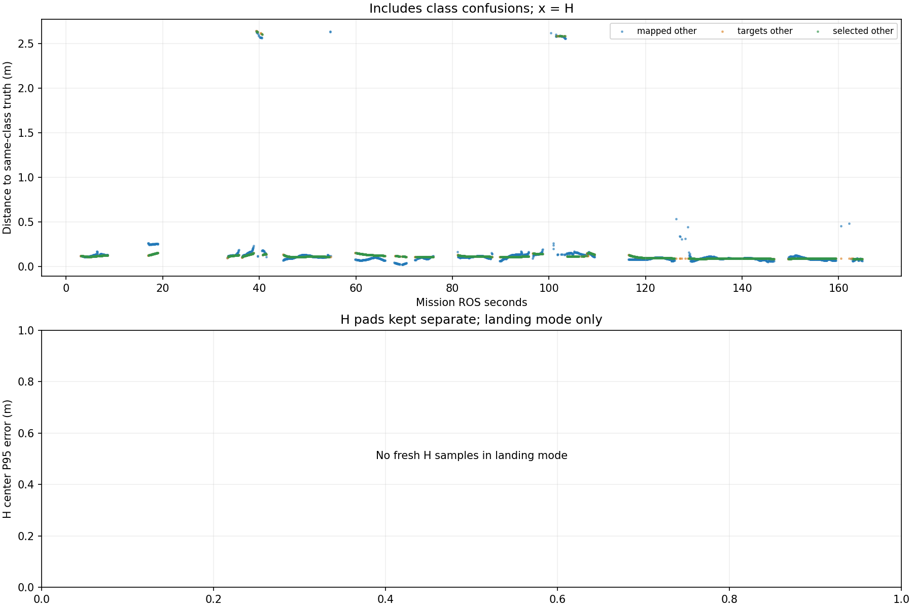

# Recorded target-center comparison

Phase-specific interpretation: [frozen SURVEY, interrupt and low reacquisition comparison](stages/PHASE_REPORT.md). The full-mission statistics below are not initial-high or low-only values.

Scope: 38_resume_on
Gate: FAIL. Same-source route/speed matrix; see main report for paired comparisons and failures.

Run: /home/xhj/liftrace-worktrees/r2026-high-view-search/logs/seed38_resume_resume_on_seed38_20261005_165940
World: /home/xhj/liftrace-worktrees/r2026-high-view-search/docs/verification/seed38_resume_20261005/generated/resume_on_38/resume_on_seed38/field.world
Coordinate transform: FLU world XY equals mission XY; local Z ground=-0.22, only XY distances compared

Distances below are to same-class truth; inspect the class/instance table before interpreting localization.

| Scope | Stream | Class | Truth instance | N | Median/m | P95/m | RMSE/m | Max/m |
|---|---|---|---|---:|---:|---:|---:|---:|
| unique_valid_mission | hint_bbox | bridge | random_bridge | 10 | 0.1210 | 0.1511 | 0.1255 | 0.1563 |
| unique_valid_mission | hint_bbox | panzer | random_panzer | 12 | 0.2813 | 2.6800 | 1.3559 | 2.6876 |
| unique_valid_mission | hint_bbox | red_cross | random_red_cross | 4 | 0.1271 | 0.1289 | 0.1273 | 0.1291 |
| unique_valid_mission | hint_bbox | tent | random_tent | 10 | 0.1049 | 0.1591 | 0.1165 | 0.1796 |
| unique_valid_mission | hint_vision | bridge | random_bridge | 18 | 0.1202 | 0.1243 | 0.1194 | 0.1248 |
| unique_valid_mission | hint_vision | panzer | random_panzer | 33 | 0.0884 | 0.0937 | 0.0891 | 0.0983 |
| unique_valid_mission | hint_vision | pillbox | random_pillbox | 2 | 0.1062 | 0.1062 | 0.1062 | 0.1062 |
| unique_valid_mission | hint_vision | red_cross | random_red_cross | 40 | 0.1226 | 0.1448 | 0.1263 | 0.1482 |
| unique_valid_mission | hint_vision | tent | random_tent | 18 | 0.1255 | 0.1400 | 0.1259 | 0.1420 |
| unique_valid_mission | mapped | bridge | random_bridge | 291 | 0.1186 | 0.1498 | 0.1190 | 0.1892 |
| unique_valid_mission | mapped | panzer | random_panzer | 832 | 0.0894 | 2.5672 | 0.6231 | 2.6447 |
| unique_valid_mission | mapped | pillbox | random_pillbox | 285 | 0.1223 | 0.1608 | 0.1246 | 0.1840 |
| unique_valid_mission | mapped | red_cross | random_red_cross | 361 | 0.0992 | 0.2520 | 0.1231 | 0.2611 |
| unique_valid_mission | mapped | tent | random_tent | 92 | 0.1420 | 0.2049 | 0.1532 | 0.2612 |
| unique_valid_mission | selected | bridge | random_bridge | 276 | 0.1123 | 0.1247 | 0.1136 | 0.1296 |
| unique_valid_mission | selected | panzer | random_panzer | 776 | 0.0905 | 0.1381 | 0.3737 | 2.6396 |
| unique_valid_mission | selected | pillbox | random_pillbox | 243 | 0.1125 | 0.1338 | 0.1140 | 0.1404 |
| unique_valid_mission | selected | red_cross | random_red_cross | 331 | 0.1216 | 0.1483 | 0.1236 | 0.1542 |
| unique_valid_mission | selected | tent | random_tent | 85 | 0.1423 | 0.1477 | 0.1368 | 0.1519 |
| unique_valid_mission | targets | bridge | random_bridge | 288 | 0.1123 | 0.1251 | 0.1136 | 0.1298 |
| unique_valid_mission | targets | panzer | random_panzer | 806 | 0.0905 | 0.1460 | 0.4404 | 2.6447 |
| unique_valid_mission | targets | pillbox | random_pillbox | 248 | 0.1126 | 0.1353 | 0.1142 | 0.1404 |
| unique_valid_mission | targets | red_cross | random_red_cross | 345 | 0.1215 | 0.1487 | 0.1237 | 0.1542 |
| unique_valid_mission | targets | tent | random_tent | 89 | 0.1423 | 0.1487 | 0.1365 | 0.1519 |
| fresh_unique_mission | hint_bbox | bridge | random_bridge | 10 | 0.1210 | 0.1511 | 0.1255 | 0.1563 |
| fresh_unique_mission | hint_bbox | panzer | random_panzer | 12 | 0.2813 | 2.6800 | 1.3559 | 2.6876 |
| fresh_unique_mission | hint_bbox | red_cross | random_red_cross | 4 | 0.1271 | 0.1289 | 0.1273 | 0.1291 |
| fresh_unique_mission | hint_bbox | tent | random_tent | 10 | 0.1049 | 0.1591 | 0.1165 | 0.1796 |
| fresh_unique_mission | hint_vision | bridge | random_bridge | 18 | 0.1202 | 0.1243 | 0.1194 | 0.1248 |
| fresh_unique_mission | hint_vision | panzer | random_panzer | 33 | 0.0884 | 0.0937 | 0.0891 | 0.0983 |
| fresh_unique_mission | hint_vision | pillbox | random_pillbox | 2 | 0.1062 | 0.1062 | 0.1062 | 0.1062 |
| fresh_unique_mission | hint_vision | red_cross | random_red_cross | 40 | 0.1226 | 0.1448 | 0.1263 | 0.1482 |
| fresh_unique_mission | hint_vision | tent | random_tent | 18 | 0.1255 | 0.1400 | 0.1259 | 0.1420 |
| fresh_unique_mission | mapped | bridge | random_bridge | 291 | 0.1186 | 0.1498 | 0.1190 | 0.1892 |
| fresh_unique_mission | mapped | panzer | random_panzer | 832 | 0.0894 | 2.5672 | 0.6231 | 2.6447 |
| fresh_unique_mission | mapped | pillbox | random_pillbox | 285 | 0.1223 | 0.1608 | 0.1246 | 0.1840 |
| fresh_unique_mission | mapped | red_cross | random_red_cross | 361 | 0.0992 | 0.2520 | 0.1231 | 0.2611 |
| fresh_unique_mission | mapped | tent | random_tent | 92 | 0.1420 | 0.2049 | 0.1532 | 0.2612 |
| fresh_unique_mission | selected | bridge | random_bridge | 276 | 0.1123 | 0.1247 | 0.1136 | 0.1296 |
| fresh_unique_mission | selected | panzer | random_panzer | 776 | 0.0905 | 0.1381 | 0.3737 | 2.6396 |
| fresh_unique_mission | selected | pillbox | random_pillbox | 243 | 0.1125 | 0.1338 | 0.1140 | 0.1404 |
| fresh_unique_mission | selected | red_cross | random_red_cross | 331 | 0.1216 | 0.1483 | 0.1236 | 0.1542 |
| fresh_unique_mission | selected | tent | random_tent | 85 | 0.1423 | 0.1477 | 0.1368 | 0.1519 |
| fresh_unique_mission | targets | bridge | random_bridge | 288 | 0.1123 | 0.1251 | 0.1136 | 0.1298 |
| fresh_unique_mission | targets | panzer | random_panzer | 806 | 0.0905 | 0.1460 | 0.4404 | 2.6447 |
| fresh_unique_mission | targets | pillbox | random_pillbox | 248 | 0.1126 | 0.1353 | 0.1142 | 0.1404 |
| fresh_unique_mission | targets | red_cross | random_red_cross | 345 | 0.1215 | 0.1487 | 0.1237 | 0.1542 |
| fresh_unique_mission | targets | tent | random_tent | 89 | 0.1423 | 0.1487 | 0.1365 | 0.1519 |
| fresh_nearest_class_agrees | hint_bbox | bridge | random_bridge | 10 | 0.1210 | 0.1511 | 0.1255 | 0.1563 |
| fresh_nearest_class_agrees | hint_bbox | panzer | random_panzer | 9 | 0.2553 | 0.3149 | 0.2539 | 0.3199 |
| fresh_nearest_class_agrees | hint_bbox | red_cross | random_red_cross | 4 | 0.1271 | 0.1289 | 0.1273 | 0.1291 |
| fresh_nearest_class_agrees | hint_bbox | tent | random_tent | 10 | 0.1049 | 0.1591 | 0.1165 | 0.1796 |
| fresh_nearest_class_agrees | hint_vision | bridge | random_bridge | 18 | 0.1202 | 0.1243 | 0.1194 | 0.1248 |
| fresh_nearest_class_agrees | hint_vision | panzer | random_panzer | 33 | 0.0884 | 0.0937 | 0.0891 | 0.0983 |
| fresh_nearest_class_agrees | hint_vision | pillbox | random_pillbox | 2 | 0.1062 | 0.1062 | 0.1062 | 0.1062 |
| fresh_nearest_class_agrees | hint_vision | red_cross | random_red_cross | 40 | 0.1226 | 0.1448 | 0.1263 | 0.1482 |
| fresh_nearest_class_agrees | hint_vision | tent | random_tent | 18 | 0.1255 | 0.1400 | 0.1259 | 0.1420 |
| fresh_nearest_class_agrees | mapped | bridge | random_bridge | 291 | 0.1186 | 0.1498 | 0.1190 | 0.1892 |
| fresh_nearest_class_agrees | mapped | panzer | random_panzer | 785 | 0.0886 | 0.1226 | 0.1000 | 0.5323 |
| fresh_nearest_class_agrees | mapped | pillbox | random_pillbox | 285 | 0.1223 | 0.1608 | 0.1246 | 0.1840 |
| fresh_nearest_class_agrees | mapped | red_cross | random_red_cross | 361 | 0.0992 | 0.2520 | 0.1231 | 0.2611 |
| fresh_nearest_class_agrees | mapped | tent | random_tent | 92 | 0.1420 | 0.2049 | 0.1532 | 0.2612 |
| fresh_nearest_class_agrees | selected | bridge | random_bridge | 276 | 0.1123 | 0.1247 | 0.1136 | 0.1296 |
| fresh_nearest_class_agrees | selected | panzer | random_panzer | 761 | 0.0905 | 0.1192 | 0.0950 | 0.1548 |
| fresh_nearest_class_agrees | selected | pillbox | random_pillbox | 243 | 0.1125 | 0.1338 | 0.1140 | 0.1404 |
| fresh_nearest_class_agrees | selected | red_cross | random_red_cross | 331 | 0.1216 | 0.1483 | 0.1236 | 0.1542 |
| fresh_nearest_class_agrees | selected | tent | random_tent | 85 | 0.1423 | 0.1477 | 0.1368 | 0.1519 |
| fresh_nearest_class_agrees | targets | bridge | random_bridge | 288 | 0.1123 | 0.1251 | 0.1136 | 0.1298 |
| fresh_nearest_class_agrees | targets | panzer | random_panzer | 784 | 0.0905 | 0.1219 | 0.0951 | 0.1548 |
| fresh_nearest_class_agrees | targets | pillbox | random_pillbox | 248 | 0.1126 | 0.1353 | 0.1142 | 0.1404 |
| fresh_nearest_class_agrees | targets | red_cross | random_red_cross | 345 | 0.1215 | 0.1487 | 0.1237 | 0.1542 |
| fresh_nearest_class_agrees | targets | tent | random_tent | 89 | 0.1423 | 0.1487 | 0.1365 | 0.1519 |

## Nearest any-class instance versus predicted class

Fresh unique mapped/targets/selected; all unique mission hints. A large same-class distance can be a class error.

| Stream | Predicted | Nearest class | Nearest instance | N | Median nearest/m | Median same-class/m | Suspected confusion N |
|---|---|---|---|---:|---:|---:|---:|
| hint_bbox | bridge | bridge | random_bridge | 10 | 0.1210 | 0.1210 | 0 |
| hint_bbox | panzer | panzer | random_panzer | 9 | 0.2553 | 0.2553 | 0 |
| hint_bbox | panzer | pillbox | random_pillbox | 3 | 0.1426 | 2.6737 | 3 |
| hint_bbox | red_cross | red_cross | random_red_cross | 4 | 0.1271 | 0.1271 | 0 |
| hint_bbox | tent | tent | random_tent | 10 | 0.1049 | 0.1049 | 0 |
| hint_vision | bridge | bridge | random_bridge | 18 | 0.1202 | 0.1202 | 0 |
| hint_vision | panzer | panzer | random_panzer | 33 | 0.0884 | 0.0884 | 0 |
| hint_vision | pillbox | pillbox | random_pillbox | 2 | 0.1062 | 0.1062 | 0 |
| hint_vision | red_cross | red_cross | random_red_cross | 40 | 0.1226 | 0.1226 | 0 |
| hint_vision | tent | tent | random_tent | 18 | 0.1255 | 0.1255 | 0 |
| mapped | bridge | bridge | random_bridge | 291 | 0.1186 | 0.1186 | 0 |
| mapped | panzer | panzer | random_panzer | 785 | 0.0886 | 0.0886 | 0 |
| mapped | panzer | pillbox | random_pillbox | 47 | 0.1361 | 2.5860 | 47 |
| mapped | pillbox | pillbox | random_pillbox | 285 | 0.1223 | 0.1223 | 0 |
| mapped | red_cross | red_cross | random_red_cross | 361 | 0.0992 | 0.0992 | 0 |
| mapped | tent | tent | random_tent | 92 | 0.1420 | 0.1420 | 0 |
| selected | bridge | bridge | random_bridge | 276 | 0.1123 | 0.1123 | 0 |
| selected | panzer | panzer | random_panzer | 761 | 0.0905 | 0.0905 | 0 |
| selected | panzer | pillbox | random_pillbox | 15 | 0.1113 | 2.5844 | 15 |
| selected | pillbox | pillbox | random_pillbox | 243 | 0.1125 | 0.1125 | 0 |
| selected | red_cross | red_cross | random_red_cross | 331 | 0.1216 | 0.1216 | 0 |
| selected | tent | tent | random_tent | 85 | 0.1423 | 0.1423 | 0 |
| targets | bridge | bridge | random_bridge | 288 | 0.1123 | 0.1123 | 0 |
| targets | panzer | panzer | random_panzer | 784 | 0.0905 | 0.0905 | 0 |
| targets | panzer | pillbox | random_pillbox | 22 | 0.1109 | 2.5844 | 22 |
| targets | pillbox | pillbox | random_pillbox | 248 | 0.1126 | 0.1126 | 0 |
| targets | red_cross | red_cross | random_red_cross | 345 | 0.1215 | 0.1215 | 0 |
| targets | tent | tent | random_tent | 89 | 0.1423 | 0.1423 | 0 |

Missing bag topics: []

No rows is missing evidence, not zero error.

- Offline recorded map centers, not parcel impacts or physical release accuracy.
- Association is nearest same-class truth; not an independent instance recall evaluation.
- Same-class distance is not localization-only error: a wrong class may be near a different true instance.
- Nearest-any-instance association is diagnostic, not independently verified object identity.
- Suspected category confusion requires a different nearest class within the stated radius and a same-vs-any distance margin.
- Hint streams are reconstructed from high_view_full_events navigation_support, with explicitly supplied mission frame and projection plane.
- H start and landing pads are separate truth instances; a class/position error can change nearest association.
- World-to-evaluation transform is explicitly supplied, not estimated from the detections.
- Reported error is XY only. H dimensions do not change its center; no Z/size accuracy claim.
- Valid but old candidate publications are separate from fresh unique observations.
- TF lookup reuses bag_replay.TransformTree (latest past sample, max dynamic age 0.5s, no interpolation).
- Raw duplicates and invalid samples remain in CSV; errors aggregate only inside the mission interval.
- H branch-complete counters only show recorded pipeline completion, not proof of a detected H contour; raw detector output was not in this lightweight bag.

All samples including invalid, stale and duplicate publications: center_samples.csv.
Machine-readable provenance, truth and counts: center_summary.json.
