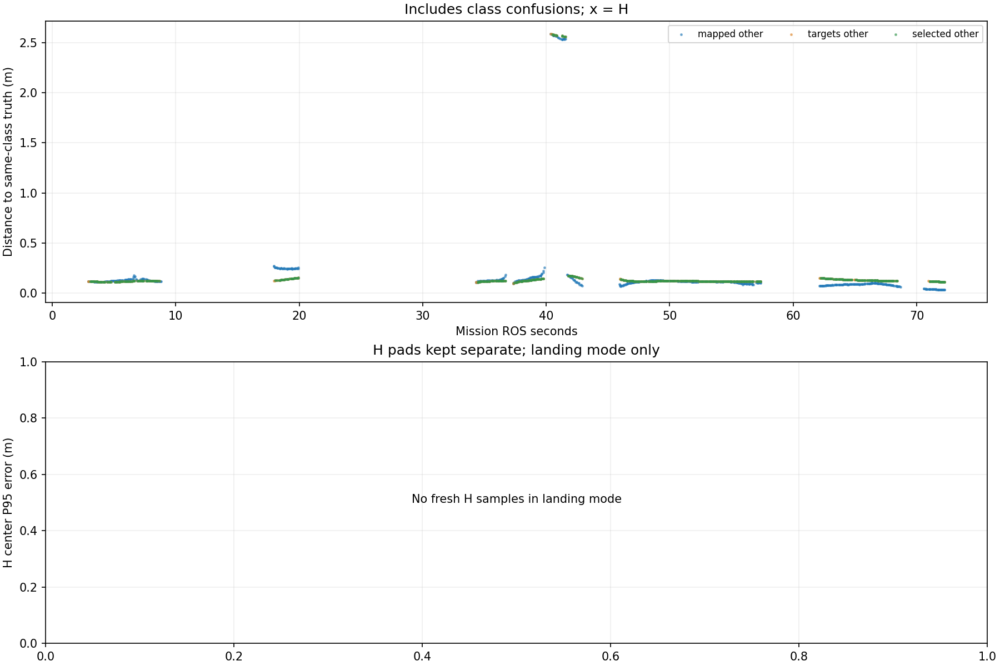

# Recorded target-center comparison

Phase-specific interpretation: [frozen SURVEY, interrupt and low reacquisition comparison](stages/PHASE_REPORT.md). The full-mission statistics below are not initial-high or low-only values.

Scope: 38_resume_off
Gate: FAIL. Same-source route/speed matrix; see main report for paired comparisons and failures.

Run: /home/xhj/liftrace-worktrees/r2026-high-view-search/logs/seed38_resume_resume_off_seed38_20261005_155057
World: /home/xhj/liftrace-worktrees/r2026-high-view-search/docs/verification/seed38_resume_20261005/generated/resume_off_38/resume_off_seed38/field.world
Coordinate transform: FLU world XY equals mission XY; local Z ground=-0.22, only XY distances compared

Distances below are to same-class truth; inspect the class/instance table before interpreting localization.

| Scope | Stream | Class | Truth instance | N | Median/m | P95/m | RMSE/m | Max/m |
|---|---|---|---|---:|---:|---:|---:|---:|
| unique_valid_mission | hint_bbox | bridge | random_bridge | 10 | 0.1305 | 0.1928 | 0.1511 | 0.2023 |
| unique_valid_mission | hint_bbox | panzer | random_panzer | 4 | 2.6111 | 2.6194 | 2.6111 | 2.6202 |
| unique_valid_mission | hint_bbox | red_cross | random_red_cross | 3 | 0.1263 | 0.1280 | 0.1268 | 0.1282 |
| unique_valid_mission | hint_bbox | tent | random_tent | 7 | 0.1201 | 0.1452 | 0.1245 | 0.1503 |
| unique_valid_mission | hint_vision | bridge | random_bridge | 17 | 0.1187 | 0.1216 | 0.1179 | 0.1220 |
| unique_valid_mission | hint_vision | pillbox | random_pillbox | 1 | 0.1200 | 0.1200 | 0.1200 | 0.1200 |
| unique_valid_mission | hint_vision | red_cross | random_red_cross | 44 | 0.1239 | 0.1432 | 0.1261 | 0.1471 |
| unique_valid_mission | hint_vision | tent | random_tent | 18 | 0.1228 | 0.1375 | 0.1228 | 0.1391 |
| unique_valid_mission | mapped | bridge | random_bridge | 45 | 0.1259 | 0.1520 | 0.1299 | 0.1849 |
| unique_valid_mission | mapped | panzer | random_panzer | 22 | 2.5520 | 2.5821 | 2.5546 | 2.5889 |
| unique_valid_mission | mapped | pillbox | random_pillbox | 239 | 0.1152 | 0.1295 | 0.1151 | 0.1838 |
| unique_valid_mission | mapped | red_cross | random_red_cross | 311 | 0.0985 | 0.2477 | 0.1283 | 0.2699 |
| unique_valid_mission | mapped | tent | random_tent | 48 | 0.1489 | 0.2026 | 0.1538 | 0.2573 |
| unique_valid_mission | selected | bridge | random_bridge | 43 | 0.1204 | 0.1233 | 0.1193 | 0.1244 |
| unique_valid_mission | selected | panzer | random_panzer | 13 | 2.5732 | 2.5822 | 2.5708 | 2.5842 |
| unique_valid_mission | selected | pillbox | random_pillbox | 233 | 0.1199 | 0.1621 | 0.1243 | 0.1734 |
| unique_valid_mission | selected | red_cross | random_red_cross | 267 | 0.1246 | 0.1485 | 0.1275 | 0.1539 |
| unique_valid_mission | selected | tent | random_tent | 45 | 0.1282 | 0.1438 | 0.1281 | 0.1464 |
| unique_valid_mission | targets | bridge | random_bridge | 45 | 0.1202 | 0.1232 | 0.1188 | 0.1244 |
| unique_valid_mission | targets | panzer | random_panzer | 15 | 2.5738 | 2.5864 | 2.5730 | 2.5889 |
| unique_valid_mission | targets | pillbox | random_pillbox | 235 | 0.1199 | 0.1619 | 0.1244 | 0.1734 |
| unique_valid_mission | targets | red_cross | random_red_cross | 277 | 0.1246 | 0.1490 | 0.1276 | 0.1539 |
| unique_valid_mission | targets | tent | random_tent | 47 | 0.1272 | 0.1437 | 0.1270 | 0.1464 |
| fresh_unique_mission | hint_bbox | bridge | random_bridge | 10 | 0.1305 | 0.1928 | 0.1511 | 0.2023 |
| fresh_unique_mission | hint_bbox | panzer | random_panzer | 4 | 2.6111 | 2.6194 | 2.6111 | 2.6202 |
| fresh_unique_mission | hint_bbox | red_cross | random_red_cross | 3 | 0.1263 | 0.1280 | 0.1268 | 0.1282 |
| fresh_unique_mission | hint_bbox | tent | random_tent | 7 | 0.1201 | 0.1452 | 0.1245 | 0.1503 |
| fresh_unique_mission | hint_vision | bridge | random_bridge | 17 | 0.1187 | 0.1216 | 0.1179 | 0.1220 |
| fresh_unique_mission | hint_vision | pillbox | random_pillbox | 1 | 0.1200 | 0.1200 | 0.1200 | 0.1200 |
| fresh_unique_mission | hint_vision | red_cross | random_red_cross | 44 | 0.1239 | 0.1432 | 0.1261 | 0.1471 |
| fresh_unique_mission | hint_vision | tent | random_tent | 18 | 0.1228 | 0.1375 | 0.1228 | 0.1391 |
| fresh_unique_mission | mapped | bridge | random_bridge | 45 | 0.1259 | 0.1520 | 0.1299 | 0.1849 |
| fresh_unique_mission | mapped | panzer | random_panzer | 22 | 2.5520 | 2.5821 | 2.5546 | 2.5889 |
| fresh_unique_mission | mapped | pillbox | random_pillbox | 239 | 0.1152 | 0.1295 | 0.1151 | 0.1838 |
| fresh_unique_mission | mapped | red_cross | random_red_cross | 311 | 0.0985 | 0.2477 | 0.1283 | 0.2699 |
| fresh_unique_mission | mapped | tent | random_tent | 48 | 0.1489 | 0.2026 | 0.1538 | 0.2573 |
| fresh_unique_mission | selected | bridge | random_bridge | 43 | 0.1204 | 0.1233 | 0.1193 | 0.1244 |
| fresh_unique_mission | selected | panzer | random_panzer | 13 | 2.5732 | 2.5822 | 2.5708 | 2.5842 |
| fresh_unique_mission | selected | pillbox | random_pillbox | 233 | 0.1199 | 0.1621 | 0.1243 | 0.1734 |
| fresh_unique_mission | selected | red_cross | random_red_cross | 267 | 0.1246 | 0.1485 | 0.1275 | 0.1539 |
| fresh_unique_mission | selected | tent | random_tent | 45 | 0.1282 | 0.1438 | 0.1281 | 0.1464 |
| fresh_unique_mission | targets | bridge | random_bridge | 45 | 0.1202 | 0.1232 | 0.1188 | 0.1244 |
| fresh_unique_mission | targets | panzer | random_panzer | 15 | 2.5738 | 2.5864 | 2.5730 | 2.5889 |
| fresh_unique_mission | targets | pillbox | random_pillbox | 235 | 0.1199 | 0.1619 | 0.1244 | 0.1734 |
| fresh_unique_mission | targets | red_cross | random_red_cross | 277 | 0.1246 | 0.1490 | 0.1276 | 0.1539 |
| fresh_unique_mission | targets | tent | random_tent | 47 | 0.1272 | 0.1437 | 0.1270 | 0.1464 |
| fresh_nearest_class_agrees | hint_bbox | bridge | random_bridge | 10 | 0.1305 | 0.1928 | 0.1511 | 0.2023 |
| fresh_nearest_class_agrees | hint_bbox | red_cross | random_red_cross | 3 | 0.1263 | 0.1280 | 0.1268 | 0.1282 |
| fresh_nearest_class_agrees | hint_bbox | tent | random_tent | 7 | 0.1201 | 0.1452 | 0.1245 | 0.1503 |
| fresh_nearest_class_agrees | hint_vision | bridge | random_bridge | 17 | 0.1187 | 0.1216 | 0.1179 | 0.1220 |
| fresh_nearest_class_agrees | hint_vision | pillbox | random_pillbox | 1 | 0.1200 | 0.1200 | 0.1200 | 0.1200 |
| fresh_nearest_class_agrees | hint_vision | red_cross | random_red_cross | 44 | 0.1239 | 0.1432 | 0.1261 | 0.1471 |
| fresh_nearest_class_agrees | hint_vision | tent | random_tent | 18 | 0.1228 | 0.1375 | 0.1228 | 0.1391 |
| fresh_nearest_class_agrees | mapped | bridge | random_bridge | 45 | 0.1259 | 0.1520 | 0.1299 | 0.1849 |
| fresh_nearest_class_agrees | mapped | pillbox | random_pillbox | 239 | 0.1152 | 0.1295 | 0.1151 | 0.1838 |
| fresh_nearest_class_agrees | mapped | red_cross | random_red_cross | 311 | 0.0985 | 0.2477 | 0.1283 | 0.2699 |
| fresh_nearest_class_agrees | mapped | tent | random_tent | 48 | 0.1489 | 0.2026 | 0.1538 | 0.2573 |
| fresh_nearest_class_agrees | selected | bridge | random_bridge | 43 | 0.1204 | 0.1233 | 0.1193 | 0.1244 |
| fresh_nearest_class_agrees | selected | pillbox | random_pillbox | 233 | 0.1199 | 0.1621 | 0.1243 | 0.1734 |
| fresh_nearest_class_agrees | selected | red_cross | random_red_cross | 267 | 0.1246 | 0.1485 | 0.1275 | 0.1539 |
| fresh_nearest_class_agrees | selected | tent | random_tent | 45 | 0.1282 | 0.1438 | 0.1281 | 0.1464 |
| fresh_nearest_class_agrees | targets | bridge | random_bridge | 45 | 0.1202 | 0.1232 | 0.1188 | 0.1244 |
| fresh_nearest_class_agrees | targets | pillbox | random_pillbox | 235 | 0.1199 | 0.1619 | 0.1244 | 0.1734 |
| fresh_nearest_class_agrees | targets | red_cross | random_red_cross | 277 | 0.1246 | 0.1490 | 0.1276 | 0.1539 |
| fresh_nearest_class_agrees | targets | tent | random_tent | 47 | 0.1272 | 0.1437 | 0.1270 | 0.1464 |

## Nearest any-class instance versus predicted class

Fresh unique mapped/targets/selected; all unique mission hints. A large same-class distance can be a class error.

| Stream | Predicted | Nearest class | Nearest instance | N | Median nearest/m | Median same-class/m | Suspected confusion N |
|---|---|---|---|---:|---:|---:|---:|
| hint_bbox | bridge | bridge | random_bridge | 10 | 0.1305 | 0.1305 | 0 |
| hint_bbox | panzer | pillbox | random_pillbox | 4 | 0.0713 | 2.6111 | 4 |
| hint_bbox | red_cross | red_cross | random_red_cross | 3 | 0.1263 | 0.1263 | 0 |
| hint_bbox | tent | tent | random_tent | 7 | 0.1201 | 0.1201 | 0 |
| hint_vision | bridge | bridge | random_bridge | 17 | 0.1187 | 0.1187 | 0 |
| hint_vision | pillbox | pillbox | random_pillbox | 1 | 0.1200 | 0.1200 | 0 |
| hint_vision | red_cross | red_cross | random_red_cross | 44 | 0.1239 | 0.1239 | 0 |
| hint_vision | tent | tent | random_tent | 18 | 0.1228 | 0.1228 | 0 |
| mapped | bridge | bridge | random_bridge | 45 | 0.1259 | 0.1259 | 0 |
| mapped | panzer | pillbox | random_pillbox | 22 | 0.1789 | 2.5520 | 22 |
| mapped | pillbox | pillbox | random_pillbox | 239 | 0.1152 | 0.1152 | 0 |
| mapped | red_cross | red_cross | random_red_cross | 311 | 0.0985 | 0.0985 | 0 |
| mapped | tent | tent | random_tent | 48 | 0.1489 | 0.1489 | 0 |
| selected | bridge | bridge | random_bridge | 43 | 0.1204 | 0.1204 | 0 |
| selected | panzer | pillbox | random_pillbox | 13 | 0.1557 | 2.5732 | 13 |
| selected | pillbox | pillbox | random_pillbox | 233 | 0.1199 | 0.1199 | 0 |
| selected | red_cross | red_cross | random_red_cross | 267 | 0.1246 | 0.1246 | 0 |
| selected | tent | tent | random_tent | 45 | 0.1282 | 0.1282 | 0 |
| targets | bridge | bridge | random_bridge | 45 | 0.1202 | 0.1202 | 0 |
| targets | panzer | pillbox | random_pillbox | 15 | 0.1547 | 2.5738 | 15 |
| targets | pillbox | pillbox | random_pillbox | 235 | 0.1199 | 0.1199 | 0 |
| targets | red_cross | red_cross | random_red_cross | 277 | 0.1246 | 0.1246 | 0 |
| targets | tent | tent | random_tent | 47 | 0.1272 | 0.1272 | 0 |

Missing bag topics: []

No rows is missing evidence, not zero error.

- Offline recorded map centers, not parcel impacts or physical release accuracy.
- Association is nearest same-class truth; not an independent instance recall evaluation.
- Same-class distance is not localization-only error: a wrong class may be near a different true instance.
- Nearest-any-instance association is diagnostic, not independently verified object identity.
- Suspected category confusion requires a different nearest class within the stated radius and a same-vs-any distance margin.
- Hint streams are reconstructed from high_view_full_events navigation_support, with explicitly supplied mission frame and projection plane.
- H start and landing pads are separate truth instances; a class/position error can change nearest association.
- World-to-evaluation transform is explicitly supplied, not estimated from the detections.
- Reported error is XY only. H dimensions do not change its center; no Z/size accuracy claim.
- Valid but old candidate publications are separate from fresh unique observations.
- TF lookup reuses bag_replay.TransformTree (latest past sample, max dynamic age 0.5s, no interpolation).
- Raw duplicates and invalid samples remain in CSV; errors aggregate only inside the mission interval.
- H branch-complete counters only show recorded pipeline completion, not proof of a detected H contour; raw detector output was not in this lightweight bag.

All samples including invalid, stale and duplicate publications: center_samples.csv.
Machine-readable provenance, truth and counts: center_summary.json.
