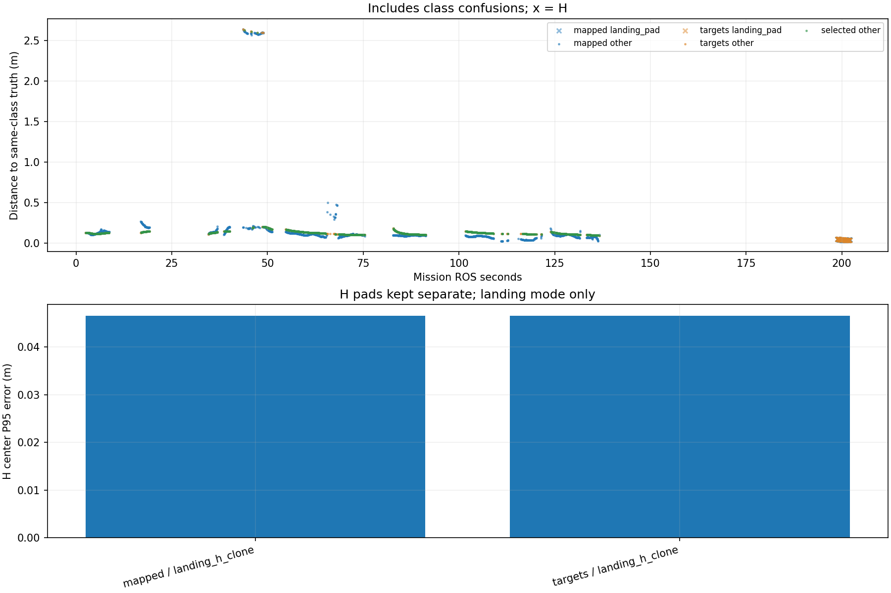

# Recorded target-center comparison

Phase-specific interpretation: [frozen SURVEY, interrupt and low reacquisition comparison](stages/PHASE_REPORT.md). The full-mission statistics below are not initial-high or low-only values.

Scope: 38_resume_on_fixed
Gate: FAIL. Same-source route/speed matrix; see main report for paired comparisons and failures.

Run: /home/xhj/liftrace-worktrees/r2026-high-view-search/logs/seed38_resume_resume_on_fixed_seed38_20261005_173322
World: /home/xhj/liftrace-worktrees/r2026-high-view-search/docs/verification/seed38_resume_20261005/generated/resume_on_38/resume_on_seed38/field.world
Coordinate transform: FLU world XY equals mission XY; local Z ground=-0.22, only XY distances compared

Distances below are to same-class truth; inspect the class/instance table before interpreting localization.

| Scope | Stream | Class | Truth instance | N | Median/m | P95/m | RMSE/m | Max/m |
|---|---|---|---|---:|---:|---:|---:|---:|
| unique_valid_mission | hint_bbox | bridge | random_bridge | 11 | 0.1313 | 0.1710 | 0.1371 | 0.1835 |
| unique_valid_mission | hint_bbox | panzer | random_panzer | 49 | 2.5853 | 2.6342 | 2.0449 | 2.7691 |
| unique_valid_mission | hint_bbox | pillbox | random_pillbox | 19 | 0.2032 | 0.3105 | 0.2234 | 0.3402 |
| unique_valid_mission | hint_bbox | red_cross | random_red_cross | 5 | 0.1133 | 0.1164 | 0.1140 | 0.1165 |
| unique_valid_mission | hint_bbox | tent | random_tent | 21 | 0.2347 | 2.7748 | 1.0752 | 2.7998 |
| unique_valid_mission | hint_vision | bridge | random_bridge | 19 | 0.1235 | 0.1299 | 0.1233 | 0.1307 |
| unique_valid_mission | hint_vision | panzer | random_panzer | 2 | 0.1686 | 0.1972 | 0.1716 | 0.2004 |
| unique_valid_mission | hint_vision | red_cross | random_red_cross | 56 | 0.1284 | 0.1431 | 0.1292 | 0.1433 |
| unique_valid_mission | mapped | bridge | random_bridge | 264 | 0.0937 | 0.1414 | 0.1011 | 0.2031 |
| unique_valid_mission | mapped | landing_pad | landing_h_clone | 62 | 0.0374 | 0.0466 | 0.0385 | 0.0475 |
| unique_valid_mission | mapped | panzer | random_panzer | 460 | 0.1073 | 2.5871 | 0.8548 | 2.6364 |
| unique_valid_mission | mapped | pillbox | random_pillbox | 205 | 0.0946 | 0.1961 | 0.1150 | 0.2128 |
| unique_valid_mission | mapped | red_cross | random_red_cross | 425 | 0.0902 | 0.2145 | 0.1216 | 0.2697 |
| unique_valid_mission | selected | bridge | random_bridge | 251 | 0.1113 | 0.1334 | 0.1139 | 0.1366 |
| unique_valid_mission | selected | panzer | random_panzer | 391 | 0.1268 | 0.1961 | 0.2650 | 2.6245 |
| unique_valid_mission | selected | pillbox | random_pillbox | 175 | 0.1102 | 0.1699 | 0.1218 | 0.1934 |
| unique_valid_mission | selected | red_cross | random_red_cross | 368 | 0.1250 | 0.1437 | 0.1263 | 0.1454 |
| unique_valid_mission | targets | bridge | random_bridge | 261 | 0.1112 | 0.1340 | 0.1139 | 0.1367 |
| unique_valid_mission | targets | landing_pad | landing_h_clone | 61 | 0.0396 | 0.0465 | 0.0404 | 0.0466 |
| unique_valid_mission | targets | panzer | random_panzer | 420 | 0.1266 | 0.1982 | 0.4240 | 2.6364 |
| unique_valid_mission | targets | pillbox | random_pillbox | 177 | 0.1104 | 0.1760 | 0.1227 | 0.1934 |
| unique_valid_mission | targets | red_cross | random_red_cross | 388 | 0.1252 | 0.1439 | 0.1263 | 0.1454 |
| fresh_unique_mission | hint_bbox | bridge | random_bridge | 11 | 0.1313 | 0.1710 | 0.1371 | 0.1835 |
| fresh_unique_mission | hint_bbox | panzer | random_panzer | 49 | 2.5853 | 2.6342 | 2.0449 | 2.7691 |
| fresh_unique_mission | hint_bbox | pillbox | random_pillbox | 19 | 0.2032 | 0.3105 | 0.2234 | 0.3402 |
| fresh_unique_mission | hint_bbox | red_cross | random_red_cross | 5 | 0.1133 | 0.1164 | 0.1140 | 0.1165 |
| fresh_unique_mission | hint_bbox | tent | random_tent | 21 | 0.2347 | 2.7748 | 1.0752 | 2.7998 |
| fresh_unique_mission | hint_vision | bridge | random_bridge | 19 | 0.1235 | 0.1299 | 0.1233 | 0.1307 |
| fresh_unique_mission | hint_vision | panzer | random_panzer | 2 | 0.1686 | 0.1972 | 0.1716 | 0.2004 |
| fresh_unique_mission | hint_vision | red_cross | random_red_cross | 56 | 0.1284 | 0.1431 | 0.1292 | 0.1433 |
| fresh_unique_mission | mapped | bridge | random_bridge | 264 | 0.0937 | 0.1414 | 0.1011 | 0.2031 |
| fresh_unique_mission | mapped | landing_pad | landing_h_clone | 62 | 0.0374 | 0.0466 | 0.0385 | 0.0475 |
| fresh_unique_mission | mapped | panzer | random_panzer | 460 | 0.1073 | 2.5871 | 0.8548 | 2.6364 |
| fresh_unique_mission | mapped | pillbox | random_pillbox | 205 | 0.0946 | 0.1961 | 0.1150 | 0.2128 |
| fresh_unique_mission | mapped | red_cross | random_red_cross | 425 | 0.0902 | 0.2145 | 0.1216 | 0.2697 |
| fresh_unique_mission | selected | bridge | random_bridge | 251 | 0.1113 | 0.1334 | 0.1139 | 0.1366 |
| fresh_unique_mission | selected | panzer | random_panzer | 391 | 0.1268 | 0.1961 | 0.2650 | 2.6245 |
| fresh_unique_mission | selected | pillbox | random_pillbox | 175 | 0.1102 | 0.1699 | 0.1218 | 0.1934 |
| fresh_unique_mission | selected | red_cross | random_red_cross | 368 | 0.1250 | 0.1437 | 0.1263 | 0.1454 |
| fresh_unique_mission | targets | bridge | random_bridge | 261 | 0.1112 | 0.1340 | 0.1139 | 0.1367 |
| fresh_unique_mission | targets | landing_pad | landing_h_clone | 61 | 0.0396 | 0.0465 | 0.0404 | 0.0466 |
| fresh_unique_mission | targets | panzer | random_panzer | 420 | 0.1266 | 0.1982 | 0.4240 | 2.6364 |
| fresh_unique_mission | targets | pillbox | random_pillbox | 177 | 0.1104 | 0.1760 | 0.1227 | 0.1934 |
| fresh_unique_mission | targets | red_cross | random_red_cross | 388 | 0.1252 | 0.1439 | 0.1263 | 0.1454 |
| fresh_nearest_class_agrees | hint_bbox | bridge | random_bridge | 11 | 0.1313 | 0.1710 | 0.1371 | 0.1835 |
| fresh_nearest_class_agrees | hint_bbox | panzer | random_panzer | 19 | 0.2225 | 0.3866 | 0.2627 | 0.3906 |
| fresh_nearest_class_agrees | hint_bbox | pillbox | random_pillbox | 19 | 0.2032 | 0.3105 | 0.2234 | 0.3402 |
| fresh_nearest_class_agrees | hint_bbox | red_cross | random_red_cross | 5 | 0.1133 | 0.1164 | 0.1140 | 0.1165 |
| fresh_nearest_class_agrees | hint_bbox | tent | random_tent | 18 | 0.2154 | 0.3258 | 0.2409 | 0.3369 |
| fresh_nearest_class_agrees | hint_vision | bridge | random_bridge | 19 | 0.1235 | 0.1299 | 0.1233 | 0.1307 |
| fresh_nearest_class_agrees | hint_vision | panzer | random_panzer | 2 | 0.1686 | 0.1972 | 0.1716 | 0.2004 |
| fresh_nearest_class_agrees | hint_vision | red_cross | random_red_cross | 56 | 0.1284 | 0.1431 | 0.1292 | 0.1433 |
| fresh_nearest_class_agrees | mapped | bridge | random_bridge | 264 | 0.0937 | 0.1414 | 0.1011 | 0.2031 |
| fresh_nearest_class_agrees | mapped | landing_pad | landing_h_clone | 62 | 0.0374 | 0.0466 | 0.0385 | 0.0475 |
| fresh_nearest_class_agrees | mapped | panzer | random_panzer | 411 | 0.1050 | 0.1987 | 0.1323 | 0.4983 |
| fresh_nearest_class_agrees | mapped | pillbox | random_pillbox | 205 | 0.0946 | 0.1961 | 0.1150 | 0.2128 |
| fresh_nearest_class_agrees | mapped | red_cross | random_red_cross | 425 | 0.0902 | 0.2145 | 0.1216 | 0.2697 |
| fresh_nearest_class_agrees | selected | bridge | random_bridge | 251 | 0.1113 | 0.1334 | 0.1139 | 0.1366 |
| fresh_nearest_class_agrees | selected | panzer | random_panzer | 388 | 0.1266 | 0.1936 | 0.1348 | 0.2008 |
| fresh_nearest_class_agrees | selected | pillbox | random_pillbox | 175 | 0.1102 | 0.1699 | 0.1218 | 0.1934 |
| fresh_nearest_class_agrees | selected | red_cross | random_red_cross | 368 | 0.1250 | 0.1437 | 0.1263 | 0.1454 |
| fresh_nearest_class_agrees | targets | bridge | random_bridge | 261 | 0.1112 | 0.1340 | 0.1139 | 0.1367 |
| fresh_nearest_class_agrees | targets | landing_pad | landing_h_clone | 61 | 0.0396 | 0.0465 | 0.0404 | 0.0466 |
| fresh_nearest_class_agrees | targets | panzer | random_panzer | 410 | 0.1262 | 0.1944 | 0.1346 | 0.2017 |
| fresh_nearest_class_agrees | targets | pillbox | random_pillbox | 177 | 0.1104 | 0.1760 | 0.1227 | 0.1934 |
| fresh_nearest_class_agrees | targets | red_cross | random_red_cross | 388 | 0.1252 | 0.1439 | 0.1263 | 0.1454 |
| fresh_H_landing_mode | mapped | landing_pad | landing_h_clone | 62 | 0.0374 | 0.0466 | 0.0385 | 0.0475 |
| fresh_H_landing_mode | targets | landing_pad | landing_h_clone | 61 | 0.0396 | 0.0465 | 0.0404 | 0.0466 |

## Nearest any-class instance versus predicted class

Fresh unique mapped/targets/selected; all unique mission hints. A large same-class distance can be a class error.

| Stream | Predicted | Nearest class | Nearest instance | N | Median nearest/m | Median same-class/m | Suspected confusion N |
|---|---|---|---|---:|---:|---:|---:|
| hint_bbox | bridge | bridge | random_bridge | 11 | 0.1313 | 0.1313 | 0 |
| hint_bbox | panzer | panzer | random_panzer | 19 | 0.2225 | 0.2225 | 0 |
| hint_bbox | panzer | pillbox | random_pillbox | 30 | 0.1798 | 2.5906 | 30 |
| hint_bbox | pillbox | pillbox | random_pillbox | 19 | 0.2032 | 0.2032 | 0 |
| hint_bbox | red_cross | red_cross | random_red_cross | 5 | 0.1133 | 0.1133 | 0 |
| hint_bbox | tent | pillbox | random_pillbox | 3 | 0.3687 | 2.7748 | 3 |
| hint_bbox | tent | tent | random_tent | 18 | 0.2154 | 0.2154 | 0 |
| hint_vision | bridge | bridge | random_bridge | 19 | 0.1235 | 0.1235 | 0 |
| hint_vision | panzer | panzer | random_panzer | 2 | 0.1686 | 0.1686 | 0 |
| hint_vision | red_cross | red_cross | random_red_cross | 56 | 0.1284 | 0.1284 | 0 |
| mapped | bridge | bridge | random_bridge | 264 | 0.0937 | 0.0937 | 0 |
| mapped | landing_pad | landing_pad | landing_h_clone | 62 | 0.0374 | 0.0374 | 0 |
| mapped | panzer | panzer | random_panzer | 411 | 0.1050 | 0.1050 | 0 |
| mapped | panzer | pillbox | random_pillbox | 49 | 0.1882 | 2.5871 | 49 |
| mapped | pillbox | pillbox | random_pillbox | 205 | 0.0946 | 0.0946 | 0 |
| mapped | red_cross | red_cross | random_red_cross | 425 | 0.0902 | 0.0902 | 0 |
| selected | bridge | bridge | random_bridge | 251 | 0.1113 | 0.1113 | 0 |
| selected | panzer | panzer | random_panzer | 388 | 0.1266 | 0.1266 | 0 |
| selected | panzer | pillbox | random_pillbox | 3 | 0.1930 | 2.6051 | 3 |
| selected | pillbox | pillbox | random_pillbox | 175 | 0.1102 | 0.1102 | 0 |
| selected | red_cross | red_cross | random_red_cross | 368 | 0.1250 | 0.1250 | 0 |
| targets | bridge | bridge | random_bridge | 261 | 0.1112 | 0.1112 | 0 |
| targets | landing_pad | landing_pad | landing_h_clone | 61 | 0.0396 | 0.0396 | 0 |
| targets | panzer | panzer | random_panzer | 410 | 0.1262 | 0.1262 | 0 |
| targets | panzer | pillbox | random_pillbox | 10 | 0.1925 | 2.6068 | 10 |
| targets | pillbox | pillbox | random_pillbox | 177 | 0.1104 | 0.1104 | 0 |
| targets | red_cross | red_cross | random_red_cross | 388 | 0.1252 | 0.1252 | 0 |

Missing bag topics: []

No rows is missing evidence, not zero error.

- Offline recorded map centers, not parcel impacts or physical release accuracy.
- Association is nearest same-class truth; not an independent instance recall evaluation.
- Same-class distance is not localization-only error: a wrong class may be near a different true instance.
- Nearest-any-instance association is diagnostic, not independently verified object identity.
- Suspected category confusion requires a different nearest class within the stated radius and a same-vs-any distance margin.
- Hint streams are reconstructed from high_view_full_events navigation_support, with explicitly supplied mission frame and projection plane.
- H start and landing pads are separate truth instances; a class/position error can change nearest association.
- World-to-evaluation transform is explicitly supplied, not estimated from the detections.
- Reported error is XY only. H dimensions do not change its center; no Z/size accuracy claim.
- Valid but old candidate publications are separate from fresh unique observations.
- TF lookup reuses bag_replay.TransformTree (latest past sample, max dynamic age 0.5s, no interpolation).
- Raw duplicates and invalid samples remain in CSV; errors aggregate only inside the mission interval.
- H branch-complete counters only show recorded pipeline completion, not proof of a detected H contour; raw detector output was not in this lightweight bag.

All samples including invalid, stale and duplicate publications: center_samples.csv.
Machine-readable provenance, truth and counts: center_summary.json.
