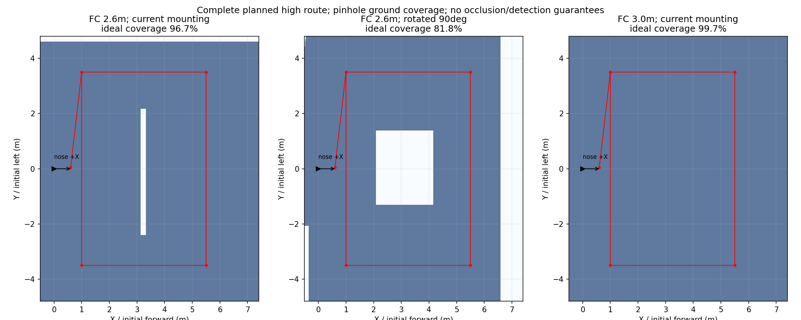

# 低空进场时序与相机方向说明

## 外参不是自动旋转相机

本轮没有修改实机相机或板端外参。用户说明实拍画面中机头指向左侧；若录制/播放器没有旋转或镜像，则图像左方对应机体前方，图像长边沿机体前后方向。这与当前研究start_fov的光学旋转q_xyzw=(0,1,0,0)一致。

本地板端known_rig.yaml仍记录q=(-0.70710678,0.70710678,0,0)，对应图像上方为机体前方。这里只发现配置与画面描述可能不一致，尚未读取本次实机有效TF、原始相机话题及录制链，不能直接断言板端实际用了错误参数或实物安装被转动。固定起飞坐标系旋转与相机相对机体安装方向是不同问题。

相机外参中的旋转是程序的方向换算：把像素的左右上下换成机体的前后左右。无需因此重新安装相机；先用未经变换的image_raw确认机体前方目标在画面哪个方向，再决定外参和旧接口pixel_to_body_matrix是否需一起更新。不要只改一个符号来掩盖不一致。本轮没有部署修改。

## 当前时序

起飞达到既有接管条件后，由任务规划：

1. 飞到固定起飞系(0.60,0.05)，飞控中心AGL 1.4m；在当前ground_z=-0.22的仿真中对应任务Z=1.18。
2. 在这个XY点规划升到AGL 2.6m，对应任务Z=2.38。
3. 确认升高动作成功，再按(1,3.5)→(1,-3.5)→(5.5,-3.5)→(5.5,3.5)→(1,3.5)执行高位路线。
4. 三个高权重目标已有合格坐标线索时可提前中断，按现有自由空间下降提案转入低空重访、复核及投递；否则继续路线并按既有兜底处理缺失目标。

低空进场没有删除原高位搜索航点；如果它或升高动作失败，不能声称高位搜索已执行。提前找到三目标的策略本来就不要求随后覆盖所有地面。

## 覆盖能力的限定结论

相机离飞控中心下方0.16m。按1280×720、fx=fy=725.351像素及已记录主点计算，在FC AGL 2.6m时，相机离地2.44m，理想地面视场约4.31×2.42m。

当前初始机头固定朝+X，两条主要长航段沿Y飞行。图像长边沿X时横跨航带，优于相差90度的另一个方向；这不等于对任意航线均是全局最优安装方向。机头方向也不能与运动方向混为一谈。

| 完整高位路线的理想覆盖 | 当前方向 | 转90度 |
| --- | --- | --- |
| FC AGL 2.6m | 约96.7% | 约81.8% |
| FC AGL 3.0m | 约99.7% | 本轮未计算 |

分母为当前验收配置墙内搜索范围X=[-0.5,7.4]、Y=[-4.8,4.8]（7.9×9.6m），不是未经墙体扣除的名义8.5×10m。1cm栅格、针孔近似，忽略畸变、树木遮挡、机体遮挡、姿态变化、绕障轨迹偏移、目标完整入镜要求和检测质量。因此这些数字是理想地面覆盖面积，不是识别召回率或真实全场保证。

2.6m仍有中部窄缝和一侧边缘缺口；升至3m能扩大几何覆盖，但不自动保证识别精度和合规。这轮仅重跑2.6m seed32，不做3m动态试验，不为了追求面积改变已批准的障碍和高度限制。

[计算数据](coverage.json)；复现脚本coverage_staging.py。图中的黑箭头为初始机头+X，不是飞机沿路线的瞬时运动方向。

补充：用户再次以左向箭头确认机头方向。安装方向与当前仿真大覆盖布置一致的判断仍以未旋转/镜像原画面为前提。本地trial_recorder.frame仅缩放raw图像，不包含旋转步骤，但现场有效版本、上游驱动和播放器尚未核实。图中世界坐标+X画向右，与相机画面中机头向左不矛盾。
