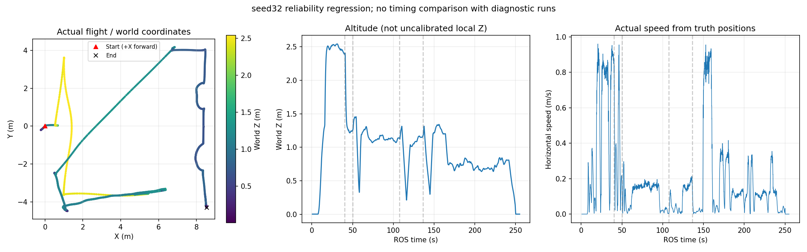

# 共享边界修正与恢复机制复杂度复核

## 本轮处理

未增加节点、状态机、计时器或重试预算。保留已有轨迹服务器→FSM保持反馈，将已复现的人工搜索边界冲突改为共用现有BoundaryRevisit几何配置。实现首先修改导航权威工作树，再同步研究与板端集成；只在fov_inner_repair研究入口显式启用，未部署上板。

## SERVER是否在堆叠控制逻辑

SERVER是TrajectoryProgress消息的来源标记，生产者为原有traj_server；不是另起的服务或第二套飞行控制器。

| 机制 | 权责 | 是否保留 |
| --- | --- | --- |
| traj_server tracking_hold | 跟踪偏差过大时保持，不自行选择新航路 | 保留 |
| ServerHoldMonitor | 对匹配goal/traj的持续保持去抖，通知原FSM | 保留，填补旧0.20–0.45m阈值死区 |
| MotionWatchdog | 有运动意图但物理位移不足时兜底 | 保留，与SERVER恢复共用目标级两次预算 |
| initial_plan_timeout | 尚未生成有效轨迹的动作等待上限 | 保留，不能替代规划可行性修复 |
| 高位survey_stall | 搜索任务的有限换点/跳点语义 | 与FSM有时间上的交互风险；本轮不新增同类监控 |

命令权威仍是任务manager→planner bridge→规划FSM/轨迹服务器→现有控制链。SERVER消息没有发航点、投递或切飞控模式的权限。不能因名字像server就删除，也不能继续为每个症状叠加恢复层。

已知剩余风险：SERVER回调和FSM调度的陈旧通知边界、物理抖动逃过位移监控、高位换点与底层恢复预算的交互仍需要定向动态覆盖；前一轮未触发SERVER恢复，不能宣称已动态验收这些分支。

## 修正的是几何契约，不是让飞机穿出占据

旧人工中心区域为X=[-0.1,7.0]、Y=[-4.4,4.4]；视觉许可由场地[-0.5,7.4,-4.8,4.8]、55cm方形包络、10度偏航预算和3cm跟踪余量计算，允许Y约-4.4514。seed32投后LIO位姿Y=-4.4057至-4.4373已经在旧人工区域外，但在视觉许可范围内。

研究入口新增一个启动参数指向现有视觉边界策略。SDF初始化读取同一场地/包络/偏航配置，不再以另一份手填矩形作为本入口的边界权威。

- 机体轴向半宽：0.55/2×(cos10°+sin10°)=0.318575m。
- 规划硬中心区域：X=[-0.181425,7.081425]、Y=[-4.481425,4.481425]。
- 视觉许可继续向内保留3cm跟踪余量，约Y≥-4.451425。
- 规划最终曲线仍要求额外2.5cm净空；启动时验证视觉跟踪余量必须大于该值。

这不是把视觉与规划门槛机械设成同一个数，而是硬边界、曲线净空与指令余量来自同一包络。树、墙的点云膨胀、限高、禁越树和走廊进入阶段控制均保持原逻辑。搜索区域仍在墙内；不会允许高位先进入走廊。新硬边界不代表机体能够突破偏航预算或任意跟踪误差，实际运行仍受原Gate约束。

共享配置缺失、未启用、非有限值、尺寸不合法或余量不足时启动拒绝。未设置共享参数的旧入口沿用原显式区域配置，避免本次研究修正直接改变板端试飞行为。参数按启动配置读取，不支持飞行中热改场地/机体几何；走廊阶段现有enabled切换仍保留。

## 验证与边界

定向几何测试使用seed32记录的交接位姿及red_cross目标，检查人工边界额外净空大于2.5cm，并确认进入走廊或靠墙过近仍拒绝；这不等于证明该点的真实点云净空合格。另检查偏航/包络、非法几何及旧矩形行为。

[seed32离线launch展开](launch_validation.json)记录共享配置来源和解析值。边界测试目标原先缺main，直接构建时发现链接失败，本轮补上测试入口，避免只写测试文件而未实际运行。

修正实施阶段未启动仿真；随后用户明确授权重跑，结果见下节。回归需检查：红十字投后能否生成第三目标轨迹、是否仍有真实障碍占据、是否满足搜索包络、走廊及降落Gate。不得将离线边界通过写成整场通过，也不以扩大人工区域替代真实地图检查。

验证完成：fast_planner_node、traj_server实际重编译成功；4项C++搜索区域测试和4项Python视觉边界测试通过，launch离线展开通过。当前没有仿真残留。

## 后续授权实跑：seed32完整PASS

运行目录：logs/seed32_shared_boundary_20260921_143805；飞行源码为652ae49。运行期间只新增分析文档和离线绘图脚本，未修改飞行配置或二进制。沿用2.6m高位、快走廊、历史seed32冻结场地，无新增提速。

- Gate：PASS/all_checks_passed，三投、三次恢复、九个投后航点、两扇门及H视觉降落全部完成。
- 任务ROS时间242.590秒（约4分03秒）；宿主执行929.20秒，RTF约0.261。不能把宿主墙钟或视频播放时长当成完赛时间。
- 原失败点：red_cross投后成功交接，120.629秒进入bridge重访，136.077秒完成重捕入口，随后第三投成功。未再出现旧Y=-4.4人工区域造成的中止。
- 搜索包络/高度/场地边界违规均0；当前Gate零碰撞检查通过。未额外执行所有历史独立树投影检查，不能把单轮PASS扩展为十轮问题全部解决。
- 最终飞控落地状态1、未解锁；包装器exit=0、收尾PASS，随后精确进程复查零残留。
- SERVER保持及物理停滞恢复本轮未触发，不计为动态故障注入覆盖；seed34未追加运行。
- 本轮保留日志、数值和图表，关闭了汇报录像；没有产生可交付的本轮视频。

[完整验收数据](result.json) · [相机方向、时序及视场覆盖](CAMERA_AND_SEQUENCE.md)

这次结果支持共享边界修正解决了seed32已复现的人工边界交接冲突；真实机载外参、实机障碍停滞和其他历史seed仍需分别验收，不由此替代。
