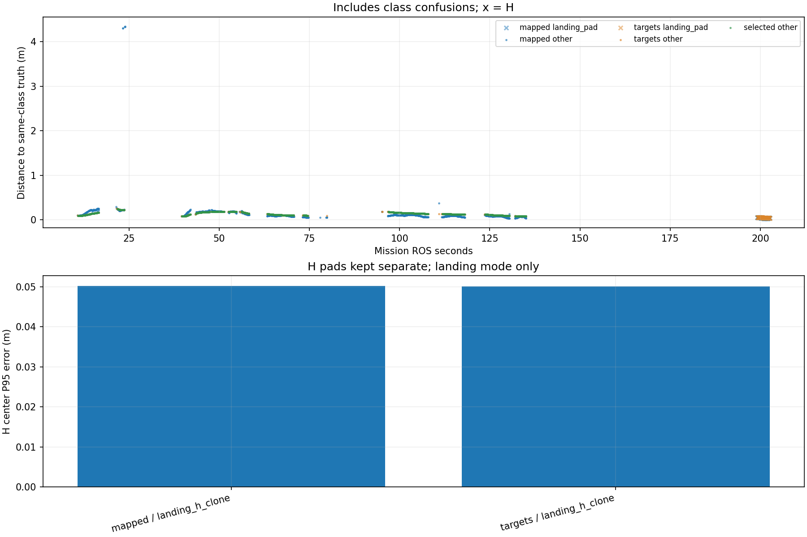

# Recorded target-center comparison

Phase-specific interpretation: [frozen SURVEY, interrupt and low reacquisition comparison](stages/PHASE_REPORT.md). The full-mission statistics below are not initial-high or low-only values.

Scope: 31_snake3
Gate: FAIL. Same-source route/speed matrix; see main report for paired comparisons and failures.

Run: /home/xhj/liftrace-worktrees/r2026-high-view-search/logs/snake3_camera2m_snake3_seed31_20261005_095902
World: /home/xhj/liftrace-worktrees/r2026-high-view-search/docs/verification/snake3_camera2m_20261005/generated/snake3_31/snake3_seed31/field.world
Coordinate transform: FLU world XY equals mission XY; local Z ground=-0.22, only XY distances compared

Distances below are to same-class truth; inspect the class/instance table before interpreting localization.

| Scope | Stream | Class | Truth instance | N | Median/m | P95/m | RMSE/m | Max/m |
|---|---|---|---|---:|---:|---:|---:|---:|
| unique_valid_mission | hint_bbox | bridge | random_bridge | 12 | 0.1157 | 7.4899 | 3.0600 | 7.4971 |
| unique_valid_mission | hint_bbox | panzer | random_panzer | 11 | 0.1065 | 4.4261 | 2.3065 | 4.4610 |
| unique_valid_mission | hint_bbox | pillbox | random_pillbox | 7 | 0.2192 | 0.2857 | 0.2359 | 0.2990 |
| unique_valid_mission | hint_bbox | red_cross | random_red_cross | 5 | 0.1967 | 0.2349 | 0.2048 | 0.2372 |
| unique_valid_mission | hint_bbox | tent | random_tent | 7 | 0.1153 | 0.1827 | 0.1370 | 0.1898 |
| unique_valid_mission | hint_vision | bridge | random_bridge | 78 | 0.1799 | 0.1825 | 0.1740 | 0.1825 |
| unique_valid_mission | hint_vision | panzer | random_panzer | 19 | 0.0824 | 0.1090 | 0.0879 | 0.1094 |
| unique_valid_mission | hint_vision | pillbox | random_pillbox | 11 | 0.2313 | 0.2404 | 0.2307 | 0.2415 |
| unique_valid_mission | hint_vision | red_cross | random_red_cross | 1 | 0.1152 | 0.1152 | 0.1152 | 0.1152 |
| unique_valid_mission | hint_vision | tent | random_tent | 45 | 0.1141 | 0.1525 | 0.1194 | 0.1559 |
| unique_valid_mission | mapped | bridge | random_bridge | 518 | 0.1044 | 0.1961 | 0.1327 | 0.3740 |
| unique_valid_mission | mapped | landing_pad | landing_h_clone | 67 | 0.0367 | 0.0502 | 0.0401 | 0.0506 |
| unique_valid_mission | mapped | panzer | random_panzer | 246 | 0.0779 | 0.1832 | 0.6230 | 4.3431 |
| unique_valid_mission | mapped | pillbox | random_pillbox | 39 | 0.2206 | 0.2562 | 0.2240 | 0.2933 |
| unique_valid_mission | mapped | red_cross | random_red_cross | 232 | 0.0920 | 0.1698 | 0.1006 | 0.1993 |
| unique_valid_mission | mapped | tent | random_tent | 109 | 0.1816 | 0.2454 | 0.1774 | 0.2511 |
| unique_valid_mission | selected | bridge | random_bridge | 499 | 0.1545 | 0.1824 | 0.1552 | 0.1826 |
| unique_valid_mission | selected | panzer | random_panzer | 227 | 0.0950 | 0.1194 | 0.0964 | 0.1246 |
| unique_valid_mission | selected | pillbox | random_pillbox | 27 | 0.2212 | 0.2442 | 0.2267 | 0.2456 |
| unique_valid_mission | selected | red_cross | random_red_cross | 195 | 0.1082 | 0.1679 | 0.1205 | 0.1837 |
| unique_valid_mission | selected | tent | random_tent | 107 | 0.1162 | 0.1582 | 0.1224 | 0.1620 |
| unique_valid_mission | targets | bridge | random_bridge | 514 | 0.1542 | 0.1824 | 0.1552 | 0.1826 |
| unique_valid_mission | targets | landing_pad | landing_h_clone | 65 | 0.0439 | 0.0501 | 0.0438 | 0.0502 |
| unique_valid_mission | targets | panzer | random_panzer | 237 | 0.0948 | 0.1202 | 0.0964 | 0.1246 |
| unique_valid_mission | targets | pillbox | random_pillbox | 29 | 0.2218 | 0.2492 | 0.2287 | 0.2555 |
| unique_valid_mission | targets | red_cross | random_red_cross | 208 | 0.1081 | 0.1700 | 0.1207 | 0.1837 |
| unique_valid_mission | targets | tent | random_tent | 109 | 0.1152 | 0.1581 | 0.1219 | 0.1620 |
| fresh_unique_mission | hint_bbox | bridge | random_bridge | 12 | 0.1157 | 7.4899 | 3.0600 | 7.4971 |
| fresh_unique_mission | hint_bbox | panzer | random_panzer | 11 | 0.1065 | 4.4261 | 2.3065 | 4.4610 |
| fresh_unique_mission | hint_bbox | pillbox | random_pillbox | 7 | 0.2192 | 0.2857 | 0.2359 | 0.2990 |
| fresh_unique_mission | hint_bbox | red_cross | random_red_cross | 5 | 0.1967 | 0.2349 | 0.2048 | 0.2372 |
| fresh_unique_mission | hint_bbox | tent | random_tent | 7 | 0.1153 | 0.1827 | 0.1370 | 0.1898 |
| fresh_unique_mission | hint_vision | bridge | random_bridge | 78 | 0.1799 | 0.1825 | 0.1740 | 0.1825 |
| fresh_unique_mission | hint_vision | panzer | random_panzer | 19 | 0.0824 | 0.1090 | 0.0879 | 0.1094 |
| fresh_unique_mission | hint_vision | pillbox | random_pillbox | 11 | 0.2313 | 0.2404 | 0.2307 | 0.2415 |
| fresh_unique_mission | hint_vision | red_cross | random_red_cross | 1 | 0.1152 | 0.1152 | 0.1152 | 0.1152 |
| fresh_unique_mission | hint_vision | tent | random_tent | 45 | 0.1141 | 0.1525 | 0.1194 | 0.1559 |
| fresh_unique_mission | mapped | bridge | random_bridge | 518 | 0.1044 | 0.1961 | 0.1327 | 0.3740 |
| fresh_unique_mission | mapped | landing_pad | landing_h_clone | 67 | 0.0367 | 0.0502 | 0.0401 | 0.0506 |
| fresh_unique_mission | mapped | panzer | random_panzer | 246 | 0.0779 | 0.1832 | 0.6230 | 4.3431 |
| fresh_unique_mission | mapped | pillbox | random_pillbox | 39 | 0.2206 | 0.2562 | 0.2240 | 0.2933 |
| fresh_unique_mission | mapped | red_cross | random_red_cross | 232 | 0.0920 | 0.1698 | 0.1006 | 0.1993 |
| fresh_unique_mission | mapped | tent | random_tent | 109 | 0.1816 | 0.2454 | 0.1774 | 0.2511 |
| fresh_unique_mission | selected | bridge | random_bridge | 499 | 0.1545 | 0.1824 | 0.1552 | 0.1826 |
| fresh_unique_mission | selected | panzer | random_panzer | 227 | 0.0950 | 0.1194 | 0.0964 | 0.1246 |
| fresh_unique_mission | selected | pillbox | random_pillbox | 27 | 0.2212 | 0.2442 | 0.2267 | 0.2456 |
| fresh_unique_mission | selected | red_cross | random_red_cross | 195 | 0.1082 | 0.1679 | 0.1205 | 0.1837 |
| fresh_unique_mission | selected | tent | random_tent | 107 | 0.1162 | 0.1582 | 0.1224 | 0.1620 |
| fresh_unique_mission | targets | bridge | random_bridge | 514 | 0.1542 | 0.1824 | 0.1552 | 0.1826 |
| fresh_unique_mission | targets | landing_pad | landing_h_clone | 65 | 0.0439 | 0.0501 | 0.0438 | 0.0502 |
| fresh_unique_mission | targets | panzer | random_panzer | 237 | 0.0948 | 0.1202 | 0.0964 | 0.1246 |
| fresh_unique_mission | targets | pillbox | random_pillbox | 29 | 0.2218 | 0.2492 | 0.2287 | 0.2555 |
| fresh_unique_mission | targets | red_cross | random_red_cross | 208 | 0.1081 | 0.1700 | 0.1207 | 0.1837 |
| fresh_unique_mission | targets | tent | random_tent | 109 | 0.1152 | 0.1581 | 0.1219 | 0.1620 |
| fresh_nearest_class_agrees | hint_bbox | bridge | random_bridge | 10 | 0.1054 | 0.1629 | 0.1212 | 0.1651 |
| fresh_nearest_class_agrees | hint_bbox | panzer | random_panzer | 8 | 0.0900 | 0.1349 | 0.0997 | 0.1416 |
| fresh_nearest_class_agrees | hint_bbox | pillbox | random_pillbox | 7 | 0.2192 | 0.2857 | 0.2359 | 0.2990 |
| fresh_nearest_class_agrees | hint_bbox | red_cross | random_red_cross | 5 | 0.1967 | 0.2349 | 0.2048 | 0.2372 |
| fresh_nearest_class_agrees | hint_bbox | tent | random_tent | 7 | 0.1153 | 0.1827 | 0.1370 | 0.1898 |
| fresh_nearest_class_agrees | hint_vision | bridge | random_bridge | 78 | 0.1799 | 0.1825 | 0.1740 | 0.1825 |
| fresh_nearest_class_agrees | hint_vision | panzer | random_panzer | 19 | 0.0824 | 0.1090 | 0.0879 | 0.1094 |
| fresh_nearest_class_agrees | hint_vision | pillbox | random_pillbox | 11 | 0.2313 | 0.2404 | 0.2307 | 0.2415 |
| fresh_nearest_class_agrees | hint_vision | red_cross | random_red_cross | 1 | 0.1152 | 0.1152 | 0.1152 | 0.1152 |
| fresh_nearest_class_agrees | hint_vision | tent | random_tent | 45 | 0.1141 | 0.1525 | 0.1194 | 0.1559 |
| fresh_nearest_class_agrees | mapped | bridge | random_bridge | 518 | 0.1044 | 0.1961 | 0.1327 | 0.3740 |
| fresh_nearest_class_agrees | mapped | landing_pad | landing_h_clone | 67 | 0.0367 | 0.0502 | 0.0401 | 0.0506 |
| fresh_nearest_class_agrees | mapped | panzer | random_panzer | 241 | 0.0777 | 0.1714 | 0.0891 | 0.2311 |
| fresh_nearest_class_agrees | mapped | pillbox | random_pillbox | 39 | 0.2206 | 0.2562 | 0.2240 | 0.2933 |
| fresh_nearest_class_agrees | mapped | red_cross | random_red_cross | 232 | 0.0920 | 0.1698 | 0.1006 | 0.1993 |
| fresh_nearest_class_agrees | mapped | tent | random_tent | 109 | 0.1816 | 0.2454 | 0.1774 | 0.2511 |
| fresh_nearest_class_agrees | selected | bridge | random_bridge | 499 | 0.1545 | 0.1824 | 0.1552 | 0.1826 |
| fresh_nearest_class_agrees | selected | panzer | random_panzer | 227 | 0.0950 | 0.1194 | 0.0964 | 0.1246 |
| fresh_nearest_class_agrees | selected | pillbox | random_pillbox | 27 | 0.2212 | 0.2442 | 0.2267 | 0.2456 |
| fresh_nearest_class_agrees | selected | red_cross | random_red_cross | 195 | 0.1082 | 0.1679 | 0.1205 | 0.1837 |
| fresh_nearest_class_agrees | selected | tent | random_tent | 107 | 0.1162 | 0.1582 | 0.1224 | 0.1620 |
| fresh_nearest_class_agrees | targets | bridge | random_bridge | 514 | 0.1542 | 0.1824 | 0.1552 | 0.1826 |
| fresh_nearest_class_agrees | targets | landing_pad | landing_h_clone | 65 | 0.0439 | 0.0501 | 0.0438 | 0.0502 |
| fresh_nearest_class_agrees | targets | panzer | random_panzer | 237 | 0.0948 | 0.1202 | 0.0964 | 0.1246 |
| fresh_nearest_class_agrees | targets | pillbox | random_pillbox | 29 | 0.2218 | 0.2492 | 0.2287 | 0.2555 |
| fresh_nearest_class_agrees | targets | red_cross | random_red_cross | 208 | 0.1081 | 0.1700 | 0.1207 | 0.1837 |
| fresh_nearest_class_agrees | targets | tent | random_tent | 109 | 0.1152 | 0.1581 | 0.1219 | 0.1620 |
| fresh_H_landing_mode | mapped | landing_pad | landing_h_clone | 67 | 0.0367 | 0.0502 | 0.0401 | 0.0506 |
| fresh_H_landing_mode | targets | landing_pad | landing_h_clone | 65 | 0.0439 | 0.0501 | 0.0438 | 0.0502 |

## Nearest any-class instance versus predicted class

Fresh unique mapped/targets/selected; all unique mission hints. A large same-class distance can be a class error.

| Stream | Predicted | Nearest class | Nearest instance | N | Median nearest/m | Median same-class/m | Suspected confusion N |
|---|---|---|---|---:|---:|---:|---:|
| hint_bbox | bridge | bridge | random_bridge | 10 | 0.1054 | 0.1054 | 0 |
| hint_bbox | bridge | pillbox | random_pillbox | 2 | 0.1064 | 7.4906 | 2 |
| hint_bbox | panzer | panzer | random_panzer | 8 | 0.0900 | 0.0900 | 0 |
| hint_bbox | panzer | pillbox | random_pillbox | 3 | 0.1241 | 4.3911 | 3 |
| hint_bbox | pillbox | pillbox | random_pillbox | 7 | 0.2192 | 0.2192 | 0 |
| hint_bbox | red_cross | red_cross | random_red_cross | 5 | 0.1967 | 0.1967 | 0 |
| hint_bbox | tent | tent | random_tent | 7 | 0.1153 | 0.1153 | 0 |
| hint_vision | bridge | bridge | random_bridge | 78 | 0.1799 | 0.1799 | 0 |
| hint_vision | panzer | panzer | random_panzer | 19 | 0.0824 | 0.0824 | 0 |
| hint_vision | pillbox | pillbox | random_pillbox | 11 | 0.2313 | 0.2313 | 0 |
| hint_vision | red_cross | red_cross | random_red_cross | 1 | 0.1152 | 0.1152 | 0 |
| hint_vision | tent | tent | random_tent | 45 | 0.1141 | 0.1141 | 0 |
| mapped | bridge | bridge | random_bridge | 518 | 0.1044 | 0.1044 | 0 |
| mapped | landing_pad | landing_pad | landing_h_clone | 67 | 0.0367 | 0.0367 | 0 |
| mapped | panzer | panzer | random_panzer | 241 | 0.0777 | 0.0777 | 0 |
| mapped | panzer | pillbox | random_pillbox | 5 | 0.2235 | 4.3390 | 5 |
| mapped | pillbox | pillbox | random_pillbox | 39 | 0.2206 | 0.2206 | 0 |
| mapped | red_cross | red_cross | random_red_cross | 232 | 0.0920 | 0.0920 | 0 |
| mapped | tent | tent | random_tent | 109 | 0.1816 | 0.1816 | 0 |
| selected | bridge | bridge | random_bridge | 499 | 0.1545 | 0.1545 | 0 |
| selected | panzer | panzer | random_panzer | 227 | 0.0950 | 0.0950 | 0 |
| selected | pillbox | pillbox | random_pillbox | 27 | 0.2212 | 0.2212 | 0 |
| selected | red_cross | red_cross | random_red_cross | 195 | 0.1082 | 0.1082 | 0 |
| selected | tent | tent | random_tent | 107 | 0.1162 | 0.1162 | 0 |
| targets | bridge | bridge | random_bridge | 514 | 0.1542 | 0.1542 | 0 |
| targets | landing_pad | landing_pad | landing_h_clone | 65 | 0.0439 | 0.0439 | 0 |
| targets | panzer | panzer | random_panzer | 237 | 0.0948 | 0.0948 | 0 |
| targets | pillbox | pillbox | random_pillbox | 29 | 0.2218 | 0.2218 | 0 |
| targets | red_cross | red_cross | random_red_cross | 208 | 0.1081 | 0.1081 | 0 |
| targets | tent | tent | random_tent | 109 | 0.1152 | 0.1152 | 0 |

Missing bag topics: []

No rows is missing evidence, not zero error.

- Offline recorded map centers, not parcel impacts or physical release accuracy.
- Association is nearest same-class truth; not an independent instance recall evaluation.
- Same-class distance is not localization-only error: a wrong class may be near a different true instance.
- Nearest-any-instance association is diagnostic, not independently verified object identity.
- Suspected category confusion requires a different nearest class within the stated radius and a same-vs-any distance margin.
- Hint streams are reconstructed from high_view_full_events navigation_support, with explicitly supplied mission frame and projection plane.
- H start and landing pads are separate truth instances; a class/position error can change nearest association.
- World-to-evaluation transform is explicitly supplied, not estimated from the detections.
- Reported error is XY only. H dimensions do not change its center; no Z/size accuracy claim.
- Valid but old candidate publications are separate from fresh unique observations.
- TF lookup reuses bag_replay.TransformTree (latest past sample, max dynamic age 0.5s, no interpolation).
- Raw duplicates and invalid samples remain in CSV; errors aggregate only inside the mission interval.
- H branch-complete counters only show recorded pipeline completion, not proof of a detected H contour; raw detector output was not in this lightweight bag.

All samples including invalid, stale and duplicate publications: center_samples.csv.
Machine-readable provenance, truth and counts: center_summary.json.
