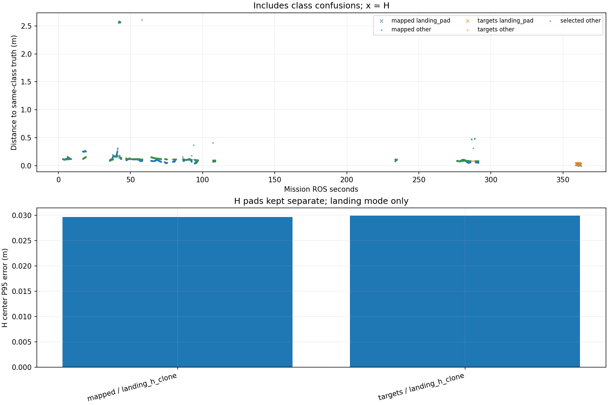

# Recorded target-center comparison

Phase-specific interpretation: [frozen SURVEY, interrupt and low reacquisition comparison](stages/PHASE_REPORT.md). The full-mission statistics below are not initial-high or low-only values.

Scope: 38_snake3
Gate: FAIL. Same-source route/speed matrix; see main report for paired comparisons and failures.

Run: /home/xhj/liftrace-worktrees/r2026-high-view-search/logs/snake3_camera2m_snake3_seed38_20261005_101903
World: /home/xhj/liftrace-worktrees/r2026-high-view-search/docs/verification/snake3_camera2m_20261005/generated/snake3_38/snake3_seed38/field.world
Coordinate transform: FLU world XY equals mission XY; local Z ground=-0.22, only XY distances compared

Distances below are to same-class truth; inspect the class/instance table before interpreting localization.

| Scope | Stream | Class | Truth instance | N | Median/m | P95/m | RMSE/m | Max/m |
|---|---|---|---|---:|---:|---:|---:|---:|
| unique_valid_mission | hint_bbox | bridge | random_bridge | 9 | 0.1127 | 0.1601 | 0.1259 | 0.1648 |
| unique_valid_mission | hint_bbox | panzer | random_panzer | 5 | 2.5925 | 2.6079 | 2.5940 | 2.6098 |
| unique_valid_mission | hint_bbox | red_cross | random_red_cross | 5 | 0.1269 | 0.1299 | 0.1273 | 0.1301 |
| unique_valid_mission | hint_bbox | tent | random_tent | 15 | 0.1700 | 1.2603 | 0.9675 | 3.6922 |
| unique_valid_mission | hint_vision | bridge | random_bridge | 20 | 0.1028 | 0.1087 | 0.1021 | 0.1100 |
| unique_valid_mission | hint_vision | pillbox | random_pillbox | 1 | 0.1204 | 0.1204 | 0.1204 | 0.1204 |
| unique_valid_mission | hint_vision | red_cross | random_red_cross | 37 | 0.1208 | 0.1433 | 0.1255 | 0.1470 |
| unique_valid_mission | hint_vision | tent | random_tent | 17 | 0.1628 | 0.1669 | 0.1630 | 0.1683 |
| unique_valid_mission | mapped | bridge | random_bridge | 253 | 0.1022 | 0.1346 | 0.1057 | 0.4077 |
| unique_valid_mission | mapped | landing_pad | landing_h_clone | 46 | 0.0266 | 0.0297 | 0.0249 | 0.0302 |
| unique_valid_mission | mapped | panzer | random_panzer | 248 | 0.0833 | 2.5653 | 0.7717 | 2.6057 |
| unique_valid_mission | mapped | pillbox | random_pillbox | 226 | 0.1140 | 0.1284 | 0.1151 | 0.1829 |
| unique_valid_mission | mapped | red_cross | random_red_cross | 380 | 0.0996 | 0.2569 | 0.1235 | 0.2652 |
| unique_valid_mission | mapped | tent | random_tent | 46 | 0.1741 | 0.2640 | 0.1964 | 0.3098 |
| unique_valid_mission | selected | bridge | random_bridge | 238 | 0.1080 | 0.1135 | 0.1048 | 0.1188 |
| unique_valid_mission | selected | panzer | random_panzer | 222 | 0.0853 | 0.0925 | 0.5509 | 2.5666 |
| unique_valid_mission | selected | pillbox | random_pillbox | 218 | 0.1185 | 0.1263 | 0.1195 | 0.1465 |
| unique_valid_mission | selected | red_cross | random_red_cross | 332 | 0.1210 | 0.1482 | 0.1247 | 0.1540 |
| unique_valid_mission | selected | tent | random_tent | 43 | 0.1628 | 0.1766 | 0.1654 | 0.1801 |
| unique_valid_mission | targets | bridge | random_bridge | 251 | 0.1080 | 0.1140 | 0.1048 | 0.1190 |
| unique_valid_mission | targets | landing_pad | landing_h_clone | 46 | 0.0279 | 0.0300 | 0.0276 | 0.0302 |
| unique_valid_mission | targets | panzer | random_panzer | 239 | 0.0852 | 2.5623 | 0.6264 | 2.5668 |
| unique_valid_mission | targets | pillbox | random_pillbox | 220 | 0.1185 | 0.1305 | 0.1197 | 0.1465 |
| unique_valid_mission | targets | red_cross | random_red_cross | 347 | 0.1209 | 0.1487 | 0.1246 | 0.1540 |
| unique_valid_mission | targets | tent | random_tent | 45 | 0.1629 | 0.1765 | 0.1658 | 0.1801 |
| fresh_unique_mission | hint_bbox | bridge | random_bridge | 9 | 0.1127 | 0.1601 | 0.1259 | 0.1648 |
| fresh_unique_mission | hint_bbox | panzer | random_panzer | 5 | 2.5925 | 2.6079 | 2.5940 | 2.6098 |
| fresh_unique_mission | hint_bbox | red_cross | random_red_cross | 5 | 0.1269 | 0.1299 | 0.1273 | 0.1301 |
| fresh_unique_mission | hint_bbox | tent | random_tent | 15 | 0.1700 | 1.2603 | 0.9675 | 3.6922 |
| fresh_unique_mission | hint_vision | bridge | random_bridge | 20 | 0.1028 | 0.1087 | 0.1021 | 0.1100 |
| fresh_unique_mission | hint_vision | pillbox | random_pillbox | 1 | 0.1204 | 0.1204 | 0.1204 | 0.1204 |
| fresh_unique_mission | hint_vision | red_cross | random_red_cross | 37 | 0.1208 | 0.1433 | 0.1255 | 0.1470 |
| fresh_unique_mission | hint_vision | tent | random_tent | 17 | 0.1628 | 0.1669 | 0.1630 | 0.1683 |
| fresh_unique_mission | mapped | bridge | random_bridge | 253 | 0.1022 | 0.1346 | 0.1057 | 0.4077 |
| fresh_unique_mission | mapped | landing_pad | landing_h_clone | 46 | 0.0266 | 0.0297 | 0.0249 | 0.0302 |
| fresh_unique_mission | mapped | panzer | random_panzer | 248 | 0.0833 | 2.5653 | 0.7717 | 2.6057 |
| fresh_unique_mission | mapped | pillbox | random_pillbox | 226 | 0.1140 | 0.1284 | 0.1151 | 0.1829 |
| fresh_unique_mission | mapped | red_cross | random_red_cross | 380 | 0.0996 | 0.2569 | 0.1235 | 0.2652 |
| fresh_unique_mission | mapped | tent | random_tent | 46 | 0.1741 | 0.2640 | 0.1964 | 0.3098 |
| fresh_unique_mission | selected | bridge | random_bridge | 238 | 0.1080 | 0.1135 | 0.1048 | 0.1188 |
| fresh_unique_mission | selected | panzer | random_panzer | 222 | 0.0853 | 0.0925 | 0.5509 | 2.5666 |
| fresh_unique_mission | selected | pillbox | random_pillbox | 218 | 0.1185 | 0.1263 | 0.1195 | 0.1465 |
| fresh_unique_mission | selected | red_cross | random_red_cross | 332 | 0.1210 | 0.1482 | 0.1247 | 0.1540 |
| fresh_unique_mission | selected | tent | random_tent | 43 | 0.1628 | 0.1766 | 0.1654 | 0.1801 |
| fresh_unique_mission | targets | bridge | random_bridge | 251 | 0.1080 | 0.1140 | 0.1048 | 0.1190 |
| fresh_unique_mission | targets | landing_pad | landing_h_clone | 46 | 0.0279 | 0.0300 | 0.0276 | 0.0302 |
| fresh_unique_mission | targets | panzer | random_panzer | 239 | 0.0852 | 2.5623 | 0.6264 | 2.5668 |
| fresh_unique_mission | targets | pillbox | random_pillbox | 220 | 0.1185 | 0.1305 | 0.1197 | 0.1465 |
| fresh_unique_mission | targets | red_cross | random_red_cross | 347 | 0.1209 | 0.1487 | 0.1246 | 0.1540 |
| fresh_unique_mission | targets | tent | random_tent | 45 | 0.1629 | 0.1765 | 0.1658 | 0.1801 |
| fresh_nearest_class_agrees | hint_bbox | bridge | random_bridge | 9 | 0.1127 | 0.1601 | 0.1259 | 0.1648 |
| fresh_nearest_class_agrees | hint_bbox | red_cross | random_red_cross | 5 | 0.1269 | 0.1299 | 0.1273 | 0.1301 |
| fresh_nearest_class_agrees | hint_bbox | tent | random_tent | 14 | 0.1681 | 0.1940 | 0.1708 | 0.2181 |
| fresh_nearest_class_agrees | hint_vision | bridge | random_bridge | 20 | 0.1028 | 0.1087 | 0.1021 | 0.1100 |
| fresh_nearest_class_agrees | hint_vision | pillbox | random_pillbox | 1 | 0.1204 | 0.1204 | 0.1204 | 0.1204 |
| fresh_nearest_class_agrees | hint_vision | red_cross | random_red_cross | 37 | 0.1208 | 0.1433 | 0.1255 | 0.1470 |
| fresh_nearest_class_agrees | hint_vision | tent | random_tent | 17 | 0.1628 | 0.1669 | 0.1630 | 0.1683 |
| fresh_nearest_class_agrees | mapped | bridge | random_bridge | 253 | 0.1022 | 0.1346 | 0.1057 | 0.4077 |
| fresh_nearest_class_agrees | mapped | landing_pad | landing_h_clone | 46 | 0.0266 | 0.0297 | 0.0249 | 0.0302 |
| fresh_nearest_class_agrees | mapped | panzer | random_panzer | 226 | 0.0821 | 0.1079 | 0.1044 | 0.4856 |
| fresh_nearest_class_agrees | mapped | pillbox | random_pillbox | 226 | 0.1140 | 0.1284 | 0.1151 | 0.1829 |
| fresh_nearest_class_agrees | mapped | red_cross | random_red_cross | 380 | 0.0996 | 0.2569 | 0.1235 | 0.2652 |
| fresh_nearest_class_agrees | mapped | tent | random_tent | 46 | 0.1741 | 0.2640 | 0.1964 | 0.3098 |
| fresh_nearest_class_agrees | selected | bridge | random_bridge | 238 | 0.1080 | 0.1135 | 0.1048 | 0.1188 |
| fresh_nearest_class_agrees | selected | panzer | random_panzer | 212 | 0.0851 | 0.0924 | 0.0864 | 0.0925 |
| fresh_nearest_class_agrees | selected | pillbox | random_pillbox | 218 | 0.1185 | 0.1263 | 0.1195 | 0.1465 |
| fresh_nearest_class_agrees | selected | red_cross | random_red_cross | 332 | 0.1210 | 0.1482 | 0.1247 | 0.1540 |
| fresh_nearest_class_agrees | selected | tent | random_tent | 43 | 0.1628 | 0.1766 | 0.1654 | 0.1801 |
| fresh_nearest_class_agrees | targets | bridge | random_bridge | 251 | 0.1080 | 0.1140 | 0.1048 | 0.1190 |
| fresh_nearest_class_agrees | targets | landing_pad | landing_h_clone | 46 | 0.0279 | 0.0300 | 0.0276 | 0.0302 |
| fresh_nearest_class_agrees | targets | panzer | random_panzer | 225 | 0.0850 | 0.0924 | 0.0863 | 0.0925 |
| fresh_nearest_class_agrees | targets | pillbox | random_pillbox | 220 | 0.1185 | 0.1305 | 0.1197 | 0.1465 |
| fresh_nearest_class_agrees | targets | red_cross | random_red_cross | 347 | 0.1209 | 0.1487 | 0.1246 | 0.1540 |
| fresh_nearest_class_agrees | targets | tent | random_tent | 45 | 0.1629 | 0.1765 | 0.1658 | 0.1801 |
| fresh_H_landing_mode | mapped | landing_pad | landing_h_clone | 46 | 0.0266 | 0.0297 | 0.0249 | 0.0302 |
| fresh_H_landing_mode | targets | landing_pad | landing_h_clone | 46 | 0.0279 | 0.0300 | 0.0276 | 0.0302 |

## Nearest any-class instance versus predicted class

Fresh unique mapped/targets/selected; all unique mission hints. A large same-class distance can be a class error.

| Stream | Predicted | Nearest class | Nearest instance | N | Median nearest/m | Median same-class/m | Suspected confusion N |
|---|---|---|---|---:|---:|---:|---:|
| hint_bbox | bridge | bridge | random_bridge | 9 | 0.1127 | 0.1127 | 0 |
| hint_bbox | panzer | pillbox | random_pillbox | 5 | 0.0586 | 2.5925 | 5 |
| hint_bbox | red_cross | red_cross | random_red_cross | 5 | 0.1269 | 0.1269 | 0 |
| hint_bbox | tent | bridge | random_bridge | 1 | 1.9765 | 3.6922 | 0 |
| hint_bbox | tent | tent | random_tent | 14 | 0.1681 | 0.1681 | 0 |
| hint_vision | bridge | bridge | random_bridge | 20 | 0.1028 | 0.1028 | 0 |
| hint_vision | pillbox | pillbox | random_pillbox | 1 | 0.1204 | 0.1204 | 0 |
| hint_vision | red_cross | red_cross | random_red_cross | 37 | 0.1208 | 0.1208 | 0 |
| hint_vision | tent | tent | random_tent | 17 | 0.1628 | 0.1628 | 0 |
| mapped | bridge | bridge | random_bridge | 253 | 0.1022 | 0.1022 | 0 |
| mapped | landing_pad | landing_pad | landing_h_clone | 46 | 0.0266 | 0.0266 | 0 |
| mapped | panzer | panzer | random_panzer | 226 | 0.0821 | 0.0821 | 0 |
| mapped | panzer | pillbox | random_pillbox | 22 | 0.1503 | 2.5666 | 22 |
| mapped | pillbox | pillbox | random_pillbox | 226 | 0.1140 | 0.1140 | 0 |
| mapped | red_cross | red_cross | random_red_cross | 380 | 0.0996 | 0.0996 | 0 |
| mapped | tent | tent | random_tent | 46 | 0.1741 | 0.1741 | 0 |
| selected | bridge | bridge | random_bridge | 238 | 0.1080 | 0.1080 | 0 |
| selected | panzer | panzer | random_panzer | 212 | 0.0851 | 0.0851 | 0 |
| selected | panzer | pillbox | random_pillbox | 10 | 0.1470 | 2.5657 | 10 |
| selected | pillbox | pillbox | random_pillbox | 218 | 0.1185 | 0.1185 | 0 |
| selected | red_cross | red_cross | random_red_cross | 332 | 0.1210 | 0.1210 | 0 |
| selected | tent | tent | random_tent | 43 | 0.1628 | 0.1628 | 0 |
| targets | bridge | bridge | random_bridge | 251 | 0.1080 | 0.1080 | 0 |
| targets | landing_pad | landing_pad | landing_h_clone | 46 | 0.0279 | 0.0279 | 0 |
| targets | panzer | panzer | random_panzer | 225 | 0.0850 | 0.0850 | 0 |
| targets | panzer | pillbox | random_pillbox | 14 | 0.1434 | 2.5657 | 14 |
| targets | pillbox | pillbox | random_pillbox | 220 | 0.1185 | 0.1185 | 0 |
| targets | red_cross | red_cross | random_red_cross | 347 | 0.1209 | 0.1209 | 0 |
| targets | tent | tent | random_tent | 45 | 0.1629 | 0.1629 | 0 |

Missing bag topics: []

No rows is missing evidence, not zero error.

- Offline recorded map centers, not parcel impacts or physical release accuracy.
- Association is nearest same-class truth; not an independent instance recall evaluation.
- Same-class distance is not localization-only error: a wrong class may be near a different true instance.
- Nearest-any-instance association is diagnostic, not independently verified object identity.
- Suspected category confusion requires a different nearest class within the stated radius and a same-vs-any distance margin.
- Hint streams are reconstructed from high_view_full_events navigation_support, with explicitly supplied mission frame and projection plane.
- H start and landing pads are separate truth instances; a class/position error can change nearest association.
- World-to-evaluation transform is explicitly supplied, not estimated from the detections.
- Reported error is XY only. H dimensions do not change its center; no Z/size accuracy claim.
- Valid but old candidate publications are separate from fresh unique observations.
- TF lookup reuses bag_replay.TransformTree (latest past sample, max dynamic age 0.5s, no interpolation).
- Raw duplicates and invalid samples remain in CSV; errors aggregate only inside the mission interval.
- H branch-complete counters only show recorded pipeline completion, not proof of a detected H contour; raw detector output was not in this lightweight bag.

All samples including invalid, stale and duplicate publications: center_samples.csv.
Machine-readable provenance, truth and counts: center_summary.json.
