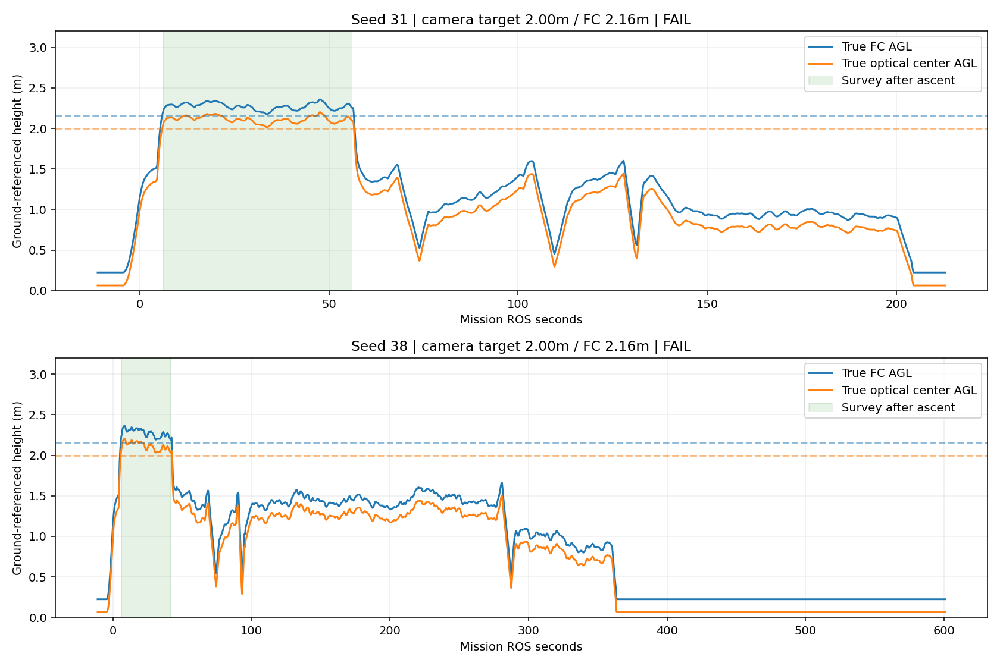

# 镜头2m三扫描线两轮整机补验

本次按原设计恢复镜头AGL **2.00m**、FC中心AGL **2.16m**；三线X=1.0/3.7/6.4m，端点Y=-3.95/+4.10m。原六轮的镜头2.6m内收三线保留，不能混作2m结果。

两轮固定源码`337b5836`。生产代码与上一批87258798相同，只改本批高度、航线及绝对场景入口；模型、速度、10×10m净场地、四树、靶位、H80cm、障碍柱和膨胀保持一致。场景逐文件比较见geometry_comparison.json。

| seed | 原始Gate | 正确标签模拟释放 | 实体碰撞 | 物理落地任务秒 | 原2.6m三线落地秒 | 差值（新−旧） |
|---|---|---:|---:|---:|---:|---:|
| 31 | FAIL | 3/3 | 0 | 204.52 | 228.18 | -23.66 |
| 38 | FAIL | 3/3 | 0 | 363.54 | 403.98 | -40.44 |

按用户约定的落地后飞手切停口径，两轮均完成三类正确模拟释放、两扇门和H落地，实体碰撞为0。相较旧三线方案分别节省23.663s（10.37%）、40.444s（10.01%）。这仅是两个固定靶位的方案对照，不能据此宣称普遍提升10%。

## 原始失败与物理落地分开记录

- seed31：物理落地任务204.517s；落地7.732s后才出现 `probe_pose_exception:ValueError`。该时段仿真真值静止，估计高度跳变，原始Gate为FAIL。
- seed38：物理落地任务363.540s；随后飞控报告ON_GROUND并自动解除解锁，任务仍留在LAND。落地236.467s后因 `landing_deadline_reached` / `safety_motion_timed_out` 结束。现场状态快照见seed38_landing_live_status.json（control_state_not_landing）。真值尾段Z范围仅3.5mm。
- 本次没有修补或放宽终态Gate，也没有把这些尾段软件缺陷写成已解决；保留原始FAIL并另列物理完成。

## seed38为何仍较慢

ROS52.990s出现的panzer粗线索位于碉堡附近；53.201s高位集齐中断发生在第二条扫描线上，第三条尚未飞完。低空61.110s已将panzer纠正为pillbox，61.206s将该位置延期，未在碉堡上错误投递。106.176s转入LOW_COVERAGE，之后寻找真正panzer并于298.914s释放；补搜启动至第三次ACK约192.7s，包含最终接近、对准。

旧镜头2.6m三线seed38也经历了同样的高空误线索→低空纠正→补搜。此次降低镜头高度没有根除提前中断问题，但类别修复挡住了误投。后续可研究低空否定后接着飞未完成高位航段；本次只记录建议，不修改固定测试版本。完整事件见behavior.json。

## 理想覆盖的边界

完整飞完新三线时，按实测FOV比例、固定朝向和2cm网格估算：搜索净区84.5㎡的点覆盖99.2%，1×1m靶的合法中心覆盖100%，整张靶完整入镜覆盖99.11%。旧2.6m三线对应99.8%、100%、99.78%。84.5㎡是扣除走廊与隔墙后的搜索区域，整个场地仍为10×10m。

这说明低一些、横向展开的三线几何覆盖基本够用，但不是保证识别成功。seed38提前中断，尤其不能把理想整圈覆盖当作该轮实际覆盖。

原始Gate不改写；另列物理落地并依据用户落地后飞手切停口径判断。任何空中碰撞、错误靶位释放均不因落地而豁免。计时从任务接受开始，视频播放长度不是完赛秒数。

## 实际高度

CSV真值已扣0.22m起飞参考偏移，以下加回得到FC离地，再按同帧完整姿态旋转相机−0.16m安装偏移求镜头高度。取高位SURVEY且ascent_verified之后的样本，包含巡航跟踪波动；并非直接抄YAML。

| seed | FC真高P05 / 中位 / P95(m) | 镜头真高P05 / 中位 / P95(m) |
|---|---|---|
| 31 | 2.20 / 2.27 / 2.34 | 2.04 / 2.11 / 2.18 |
| 38 | 2.20 / 2.29 / 2.34 | 2.04 / 2.13 / 2.18 |

注意：设定是镜头2.00m，但巡航实际镜头中位数为2.114/2.128m，仍比设定高约11–13cm。表中FC与镜头均来自同帧仿真真值；不能把配置值当作精确实测高度。这两轮纠正了原先2.6m镜头配置，尚不能宣称高度跟踪已零偏差。

## 投递位置与中心误差

释放位置核查使用仿真真值中的机体中心和最近靶标，不能当作包裹弹道落点精度。低空确认误差、逐帧中心投影和各阶段图表见各seed的centers目录。

### seed31

终止原因：`manager_failed`。

- 槽1：任务标签red_cross，最近真实靶red_cross，机体中心距靶心3.3cm。
- 槽2：任务标签bridge，最近真实靶bridge，机体中心距靶心11.4cm。
- 槽3：任务标签panzer，最近真实靶panzer，机体中心距靶心4.8cm。

[低空/投递中心分析](31_snake3_centers/center_summary.json)
[完整运行目录](../../../../r2026-high-view-search/logs/snake3_camera2m_snake3_seed31_20261005_095902/)

### seed38

终止原因：`manager_failed`。

- 槽1：任务标签red_cross，最近真实靶red_cross，机体中心距靶心1.9cm。
- 槽2：任务标签bridge，最近真实靶bridge，机体中心距靶心7.7cm。
- 槽3：任务标签panzer，最近真实靶panzer，机体中心距靶心14.0cm。

[低空/投递中心分析](38_snake3_centers/center_summary.json)
[完整运行目录](../../../../r2026-high-view-search/logs/snake3_camera2m_snake3_seed38_20261005_101903/)

## 低空确认中心误差

这是进入低空确认时的地图中心与同类靶真实中心的XY距离，不是释放点或包裹落点。seed38的panzer通过后续补搜完成，没有同名低空重访事件，留空而不填零。

| seed | 红十字 | 桥梁 | 装甲车 |
|---|---:|---:|---:|
| 31 | 11.5cm | 15.4cm | 10.9cm |
| 38 | 14.1cm | 10.8cm | 无该事件 |

## 比较范围与遗留

- 本次同时恢复低高度和原三线位置，是方案比较，不是只改变高度的消融实验。
- 理想覆盖不含树遮挡、倾斜、绕行、动态模糊；实际检出/确认/释放须看本轮记录。
- 旧2.6m seed38落地后终态超时仍保留，不能拿它的超时截尾时长冒充真实飞行时长。
- 首个相对路径异常启动保留于STARTUP_DIAGNOSTIC.md，不计有效两轮；之后只有修正后的seed31/38各一轮，无替换失败结果。
- 本次不上板、不改现场2m限高专项、不合入main或整机候选。

[视频与图表入口](index.html)
